# Data Flow

This document describes the data flow patterns and request processing flows in the AgentCube platform.

## Request Processing Flow

### Overview

All client requests flow through the Router, which authenticates, routes, and proxies requests to the appropriate components.

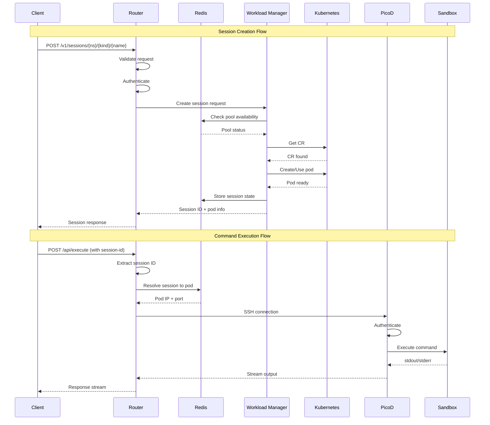
```mermaid
sequenceDiagram
    participant Client
    participant Router
    participant Redis
    participant Workload Manager
    participant Kubernetes
    participant PicoD
    participant Sandbox

    Note over Client,Sandbox: Session Creation Flow

    Client->>Router: POST /v1/sessions/{ns}/{kind}/{name}
    Router->>Router: Validate request
    Router->>Router: Authenticate
    Router->>Workload Manager: Create session request
    Workload Manager->>Redis: Check pool availability
    Redis-->>Workload Manager: Pool status
    Workload Manager->>Kubernetes: Get CR
    Kubernetes-->>Workload Manager: CR found
    Workload Manager->>Kubernetes: Create/Use pod
    Kubernetes-->>Workload Manager: Pod ready
    Workload Manager->>Redis: Store session state
    Workload Manager-->>Router: Session ID + pod info
    Router-->>Client: Session response

    Note over Client,Sandbox: Command Execution Flow

    Client->>Router: POST /api/execute (with session-id)
    Router->>Router: Extract session ID
    Router->>Redis: Resolve session to pod
    Redis-->>Router: Pod IP + port
    Router->>PicoD: SSH connection
    PicoD->>PicoD: Authenticate
    PicoD->>Sandbox: Execute command
    Sandbox-->>PicoD: stdout/stderr
    PicoD-->>Router: Stream output
    Router-->>Client: Response stream
```

### Request Types

#### 1. Session Management Requests

**Create Session**
```
POST /v1/sessions/{namespace}/{kind}/{name}
```

**Flow**:
1. Router receives request
2. Validates parameters (namespace, kind, name)
3. Authenticates client
4. Forwards to Workload Manager
5. Workload Manager checks pool
6. Creates or acquires pod
7. Stores session in Redis
8. Returns session ID

**Get Session**
```
GET /v1/sessions/{namespace}/{kind}/{name}/{session-id}
```

**Flow**:
1. Router receives request
2. Authenticates client
3. Queries Redis for session info
4. Returns session details

**Delete Session**
```
DELETE /v1/sessions/{namespace}/{kind}/{name}/{session-id}
```

**Flow**:
1. Router receives request
2. Authenticates client
3. Forwards to Workload Manager
4. Workload Manager deletes from Redis
5. Returns pod to pool or terminates
6. Returns success

#### 2. Execution Requests

**Execute Command**
```
POST /api/execute
Headers: x-agentcube-session-id: {session-id}
Body: {
  "command": ["python3", "script.py"],
  "timeout": "30s",
  "env": {"VAR": "value"}
}
```

**Flow**:
1. Router receives request with session ID header
2. Extracts and validates session ID
3. Queries Redis for pod information
4. Establishes SSH connection to PicoD
5. PicoD executes command in sandbox
6. Streams output back to Router
7. Router streams to client

**Run Code**
```
POST /api/run-code
Headers: x-agentcube-session-id: {session-id}
Body: {
  "code": "print('Hello')",
  "language": "python"
}
```

**Flow**:
1. Router receives request
2. Validates code and language
3. Writes code to temporary file
4. Executes file with appropriate interpreter
5. Streams output back to client

#### 3. File Operation Requests

**Upload File**
```
POST /api/files
Headers: x-agentcube-session-id: {session-id}
Body: {
  "path": "/workspace/file.txt",
  "content": "base64_encoded_content"
}
```

**Flow**:
1. Router receives request
2. Validates path and content
3. Connects to PicoD
4. PicoD writes file to sandbox
5. Returns success

**Download File**
```
GET /api/files?path=/workspace/file.txt
Headers: x-agentcube-session-id: {session-id}
```

**Flow**:
1. Router receives request
2. Validates path
3. Connects to PicoD
4. PicoD reads file
5. Returns file content (base64 encoded)

**List Files**
```
GET /api/files?path=/workspace
Headers: x-agentcube-session-id: {session-id}
```

**Flow**:
1. Router receives request
2. Validates path
3. Connects to PicoD
4. PicoD lists directory
5. Returns file list

**Delete File**
```
DELETE /api/files?path=/workspace/file.txt
Headers: x-agentcube-session-id: {session-id}
```

**Flow**:
1. Router receives request
2. Validates path
3. Connects to PicoD
4. PicoD deletes file
5. Returns success

## Session Lifecycle State Machine

```mermaid
stateDiagram-v2
    [*] --> Creating: POST /v1/sessions

    note right of Creating
        - Request validated
        - Authentication checked
        - Session ID generated
        - Pod creation initiated
    end note

    Creating --> Pending: Pod creation started

    note right of Pending
        - Pod scheduled
        - Container starting
        - PicoD initializing
    end note

    Pending --> Initializing: Pod running

    note right of Initializing
        - PicoD listening
        - SSH port ready
        - Connection verified
    end note

    Initializing --> Ready: Health check passed

    note right of Ready
        - Session stored in Redis
        - Ready for requests
        - Accepts commands
    end note

    Ready --> Active: First request received

    note right of Active
        - Processing requests
        - Executing commands
        - Managing files
    end note

    Active --> Idle: No activity for timeout

    note right of Idle
        - No recent requests
        - May be cleaned up
        - Can return to Active
    end note

    Idle --> Active: New request received

    Active --> Terminating: Session timeout or delete

    note right of Terminating
        - Session marked for deletion
        - Cleanup initiated
        - Resources released
    end note

    Terminating --> [*]: Cleanup complete

    Ready --> [*: Failed: Pod creation failed

    note right of Failed
        - Error logged
        - Session deleted
        - Client notified
    end note
```

### State Transitions

| From State | To State | Trigger | Action |
|------------|----------|---------|--------|
| Creating | Pending | Pod creation initiated | Update Redis state |
| Pending | Initializing | Pod running | Health check |
| Initializing | Ready | PicoD ready | Store session |
| Ready | Active | First request | Update activity timestamp |
| Active | Idle | No activity for N minutes | Update state |
| Idle | Active | New request | Update activity timestamp |
| Active | Terminating | Timeout or delete | Mark for deletion |
| Ready | Failed | Pod creation failed | Cleanup and error |
| Terminating | * | Cleanup complete | Delete from Redis |

## Component Data Flow

### Router Data Flow

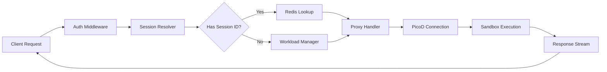
```mermaid
graph LR
    A[Client Request] --> B[Auth Middleware]
    B --> C[Session Resolver]
    C --> D{Has Session ID?}
    D -->|Yes| E[Redis Lookup]
    D -->|No| F[Workload Manager]
    E --> G[Proxy Handler]
    F --> G
    G --> H[PicoD Connection]
    H --> I[Sandbox Execution]
    I --> J[Response Stream]
    J --> A
```

### Workload Manager Data Flow

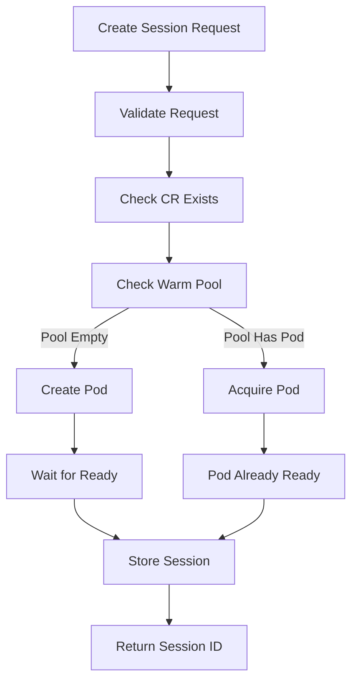
```mermaid
graph TB
    A[Create Session Request] --> B[Validate Request]
    B --> C[Check CR Exists]
    C --> D[Check Warm Pool]
    D -->|Pool Empty| E[Create Pod]
    D -->|Pool Has Pod| F[Acquire Pod]
    E --> G[Wait for Ready]
    F --> H[Pod Already Ready]
    G --> I[Store Session]
    H --> I
    I --> J[Return Session ID]
```

### Controller Data Flow

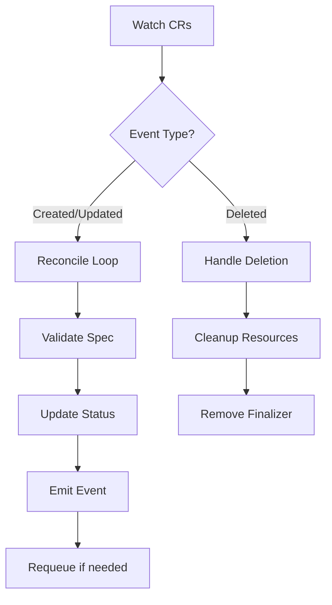
```mermaid
graph TB
    A[Watch CRs] --> B{Event Type?}
    B -->|Created/Updated| C[Reconcile Loop]
    B -->|Deleted| D[Handle Deletion]
    C --> E[Validate Spec]
    E --> F[Update Status]
    F --> G[Emit Event]
    G --> H[Requeue if needed]
    D --> I[Cleanup Resources]
    I --> J[Remove Finalizer]
```

## Error Handling Flows

### Session Creation Failure

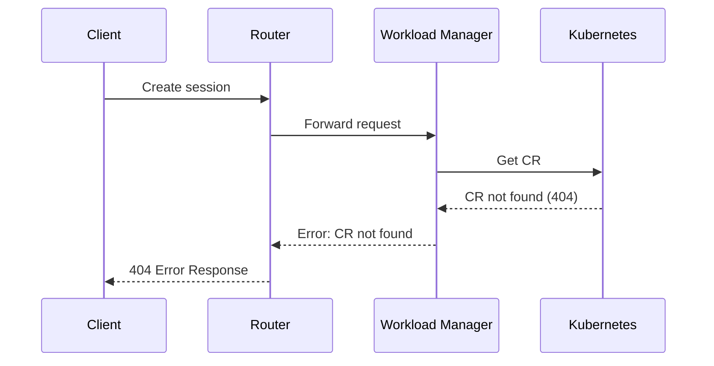
```mermaid
sequenceDiagram
    participant C as Client
    participant R as Router
    participant WM as Workload Manager
    participant K as Kubernetes

    C->>R: Create session
    R->>WM: Forward request
    WM->>K: Get CR
    K-->>WM: CR not found (404)
    WM-->>R: Error: CR not found
    R-->>C: 404 Error Response
```

### Command Execution Failure

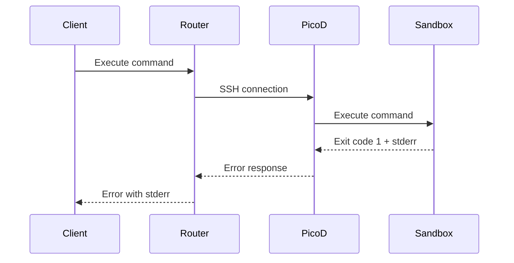
```mermaid
sequenceDiagram
    participant C as Client
    participant R as Router
    participant P as PicoD
    participant S as Sandbox

    C->>R: Execute command
    R->>P: SSH connection
    P->>S: Execute command
    S-->>P: Exit code 1 + stderr
    P-->>R: Error response
    R-->>C: Error with stderr
```

### Connection Timeout

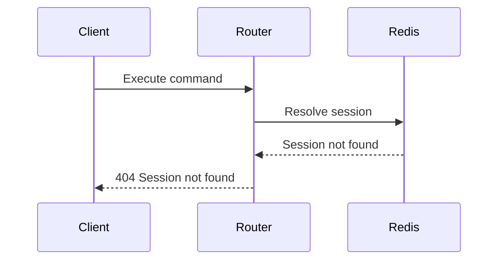
```mermaid
sequenceDiagram
    participant C as Client
    participant R as Router
    participant Re as Redis

    C->>R: Execute command
    R->>Re: Resolve session
    Re-->>R: Session not found
    R-->>C: 404 Session not found
```

### Pod Startup Failure

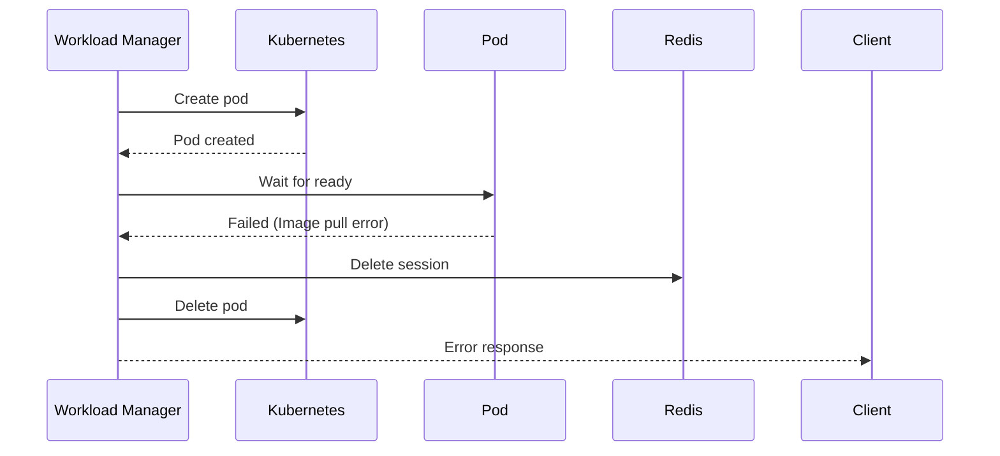
```mermaid
sequenceDiagram
    participant WM as Workload Manager
    participant K as Kubernetes
    participant P as Pod
    participant R as Redis

    WM->>K: Create pod
    K-->>WM: Pod created
    WM->>P: Wait for ready
    P-->>WM: Failed (Image pull error)
    WM->>R: Delete session
    WM->>K: Delete pod
    WM-->>Client: Error response
```

## Warm Pool Data Flow

### Pool Initialization

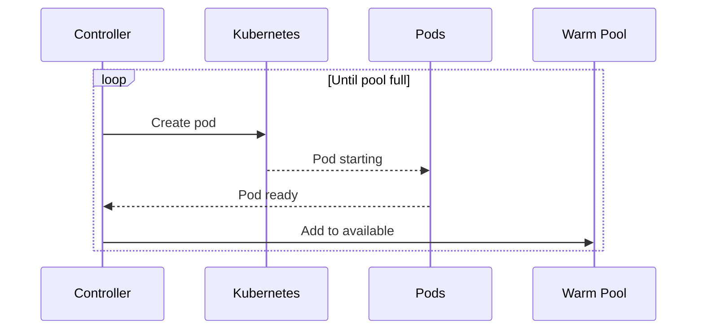
```mermaid
sequenceDiagram
    participant C as Controller
    participant K as Kubernetes
    participant P as Pods
    participant W as Warm Pool

    loop Until pool full
        C->>K: Create pod
        K-->>P: Pod starting
        P-->>C: Pod ready
        C->>W: Add to available
    end
```

### Pool Acquisition

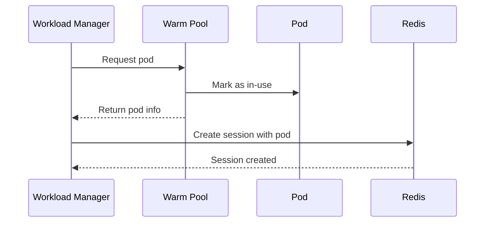
```mermaid
sequenceDiagram
    participant WM as Workload Manager
    participant W as Warm Pool
    participant P as Pod
    participant R as Redis

    WM->>W: Request pod
    W->>P: Mark as in-use
    W-->>WM: Return pod info
    WM->>R: Create session with pod
    R-->>WM: Session created
```

### Pool Release

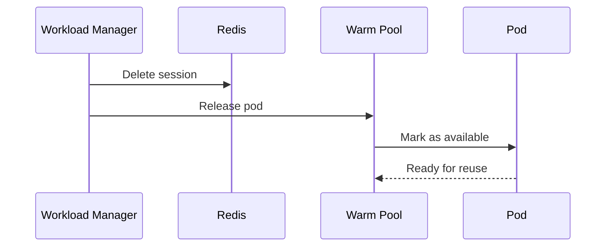
```mermaid
sequenceDiagram
    participant WM as Workload Manager
    participant R as Redis
    participant W as Warm Pool
    participant P as Pod

    WM->>R: Delete session
    WM->>W: Release pod
    W->>P: Mark as available
    P-->>W: Ready for reuse
```

## Security Data Flow

### Authentication Flow

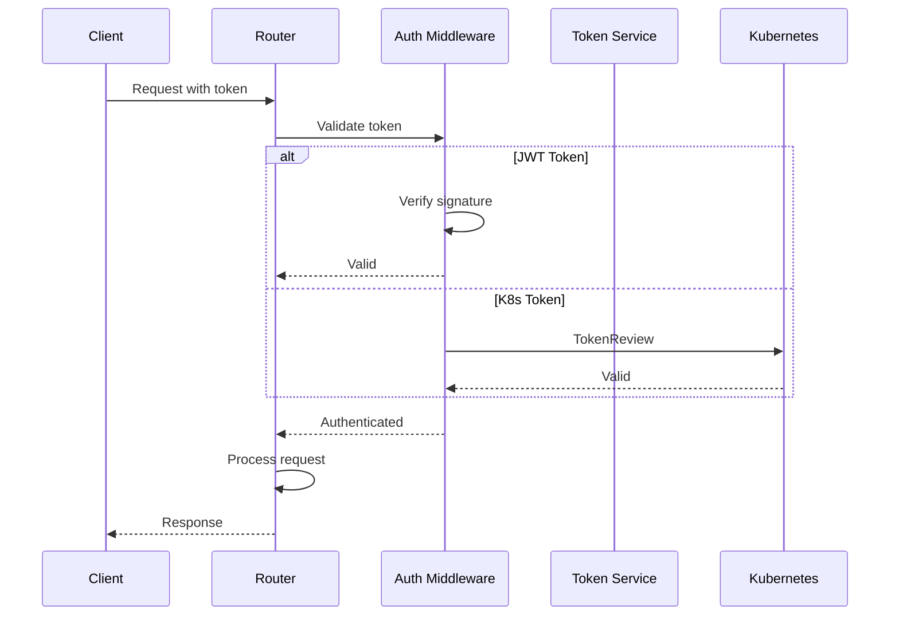
```mermaid
sequenceDiagram
    participant C as Client
    participant R as Router
    participant A as Auth Middleware
    participant T as Token Service
    participant K as Kubernetes

    C->>R: Request with token
    R->>A: Validate token
    alt JWT Token
        A->>A: Verify signature
        A-->>R: Valid
    else K8s Token
        A->>K: TokenReview
        K-->>A: Valid
    end
    A-->>R: Authenticated
    R->>R: Process request
    R-->>C: Response
```

### Authorization Flow

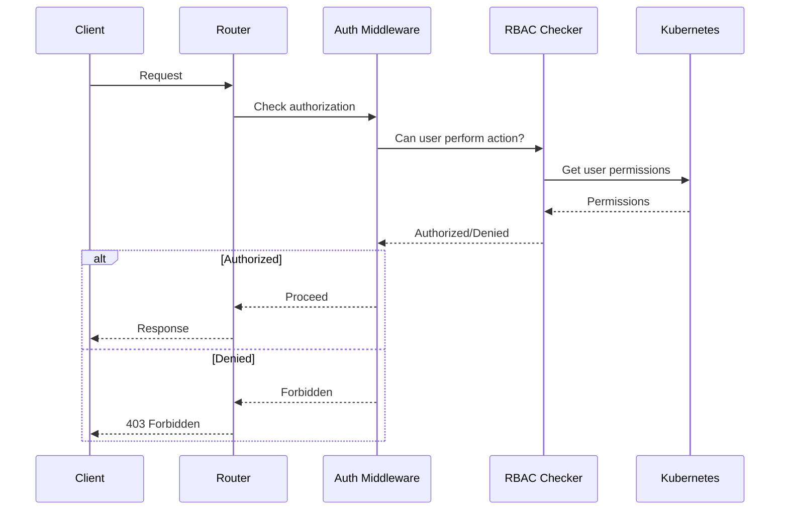
```mermaid
sequenceDiagram
    participant C as Client
    participant R as Router
    participant A as Auth Middleware
    participant RBAC as RBAC Checker
    participant K as Kubernetes

    C->>R: Request
    R->>A: Check authorization
    A->>RBAC: Can user perform action?
    RBAC->>K: Get user permissions
    K-->>RBAC: Permissions
    RBAC-->>A: Authorized/Denied
    alt Authorized
        A-->>R: Proceed
        R-->>C: Response
    else Denied
        A-->>R: Forbidden
        R-->>C: 403 Forbidden
    end
```

## Monitoring Data Flow

### Metrics Collection

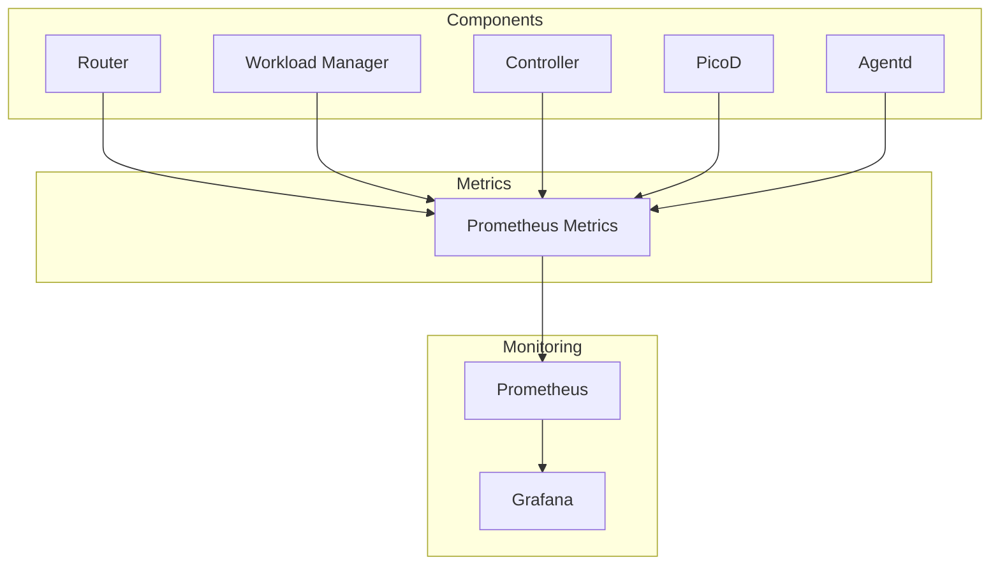
```mermaid
graph TB
    subgraph "Components"
        A[Router]
        B[Workload Manager]
        C[Controller]
        D[PicoD]
        E[Agentd]
    end

    subgraph "Metrics"
        M[Prometheus Metrics]
    end

    subgraph "Monitoring"
        P[Prometheus]
        G[Grafana]
    end

    A --> M
    B --> M
    C --> M
    D --> M
    E --> M
    M --> P
    P --> G
```

### Log Collection

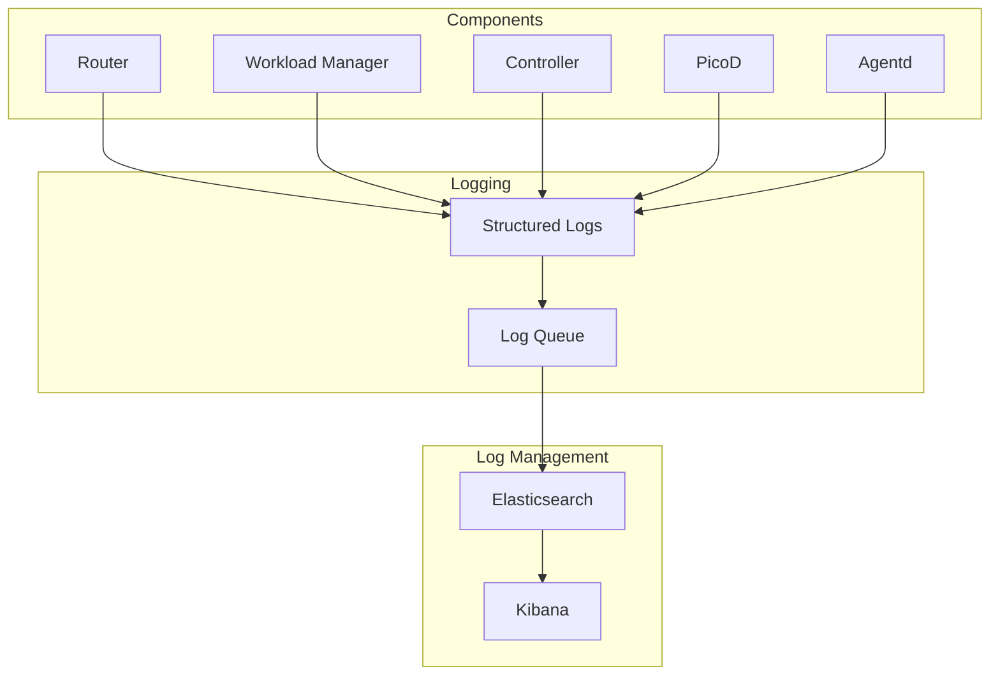
```mermaid
graph TB
    subgraph "Components"
        A[Router]
        B[Workload Manager]
        C[Controller]
        D[PicoD]
        E[Agentd]
    end

    subgraph "Logging"
        L[Structured Logs]
        CQ[Log Queue]
    end

    subgraph "Log Management"
        ES[Elasticsearch]
        K[Kibana]
    end

    A --> L
    B --> L
    C --> L
    D --> L
    E --> L
    L --> CQ
    CQ --> ES
    ES --> K
```

## Distributed Tracing

### Request Trace Flow

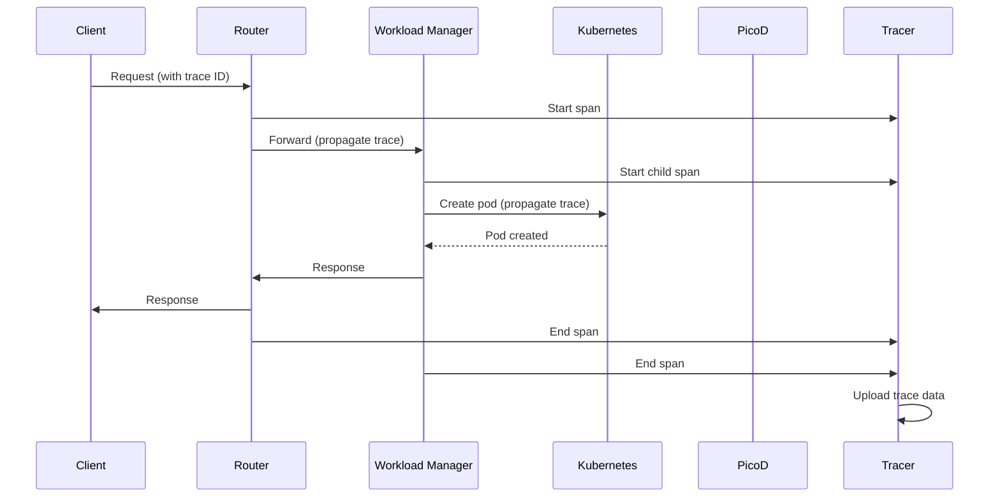
```mermaid
sequenceDiagram
    participant C as Client
    participant R as Router
    participant WM as Workload Manager
    participant K as Kubernetes
    participant P as PicoD
    participant T as Tracer

    C->>R: Request (with trace ID)
    R->>T: Start span
    R->>WM: Forward (propagate trace)
    WM->>T: Start child span
    WM->>K: Create pod (propagate trace)
    K-->>WM: Pod created
    WM->>R: Response
    R->>C: Response
    R->>T: End span
    WM->>T: End span
    T->>T: Upload trace data
```

## Data Consistency

### Redis Data Model

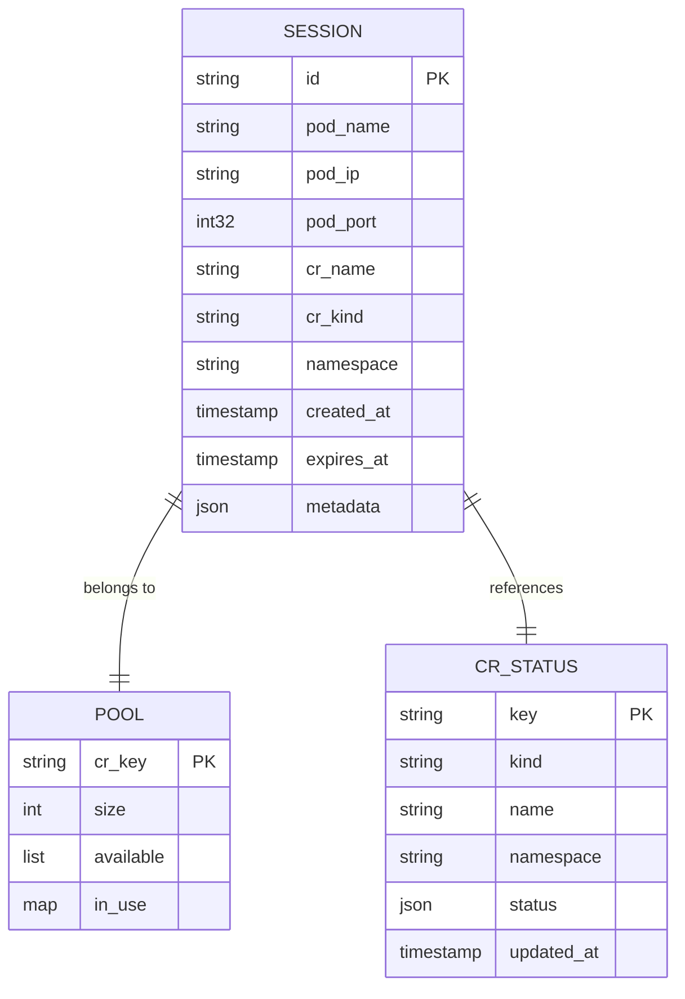
```mermaid
erDiagram
    SESSION {
        string id PK
        string pod_name
        string pod_ip
        int32 pod_port
        string cr_name
        string cr_kind
        string namespace
        timestamp created_at
        timestamp expires_at
        json metadata
    }

    POOL {
        string cr_key PK
        int size
        list available
        map in_use
    }

    CR_STATUS {
        string key PK
        string kind
        string name
        string namespace
        json status
        timestamp updated_at
    }

    SESSION ||--|| POOL : "belongs to"
    SESSION ||--|| CR_STATUS : "references"
```

### Kubernetes Resource Model

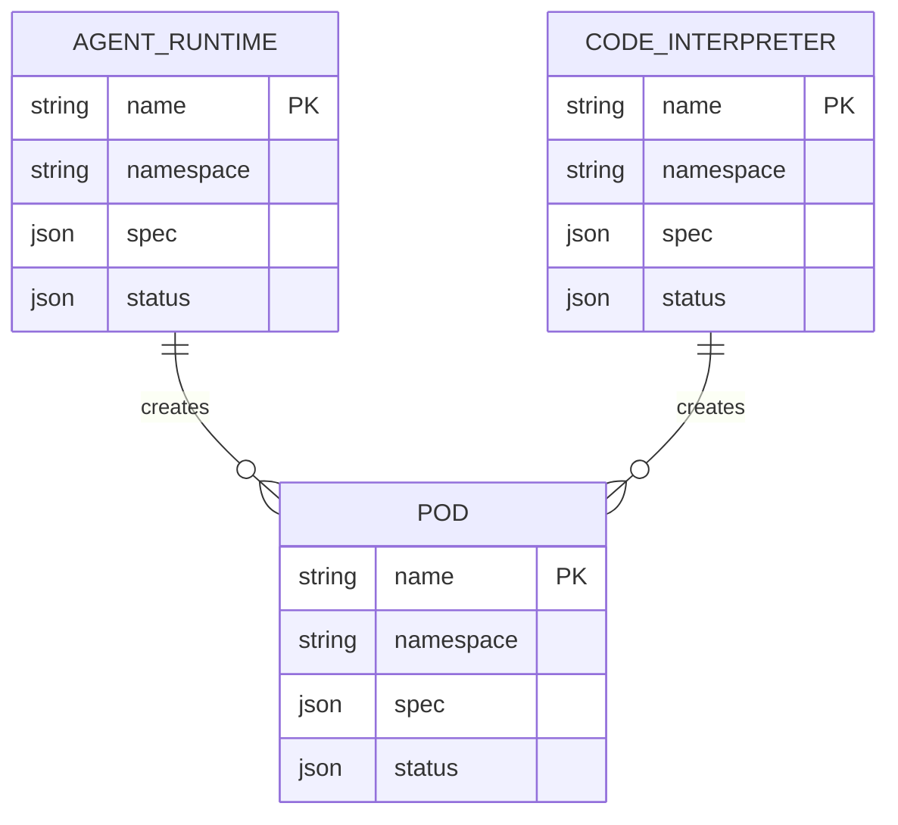
```mermaid
erDiagram
    AGENT_RUNTIME {
        string name PK
        string namespace
        json spec
        json status
    }

    CODE_INTERPRETER {
        string name PK
        string namespace
        json spec
        json status
    }

    POD {
        string name PK
        string namespace
        json spec
        json status
    }

    AGENT_RUNTIME ||--o{ POD : "creates"
    CODE_INTERPRETER ||--o{ POD : "creates"
```

## Performance Considerations

### Connection Pooling

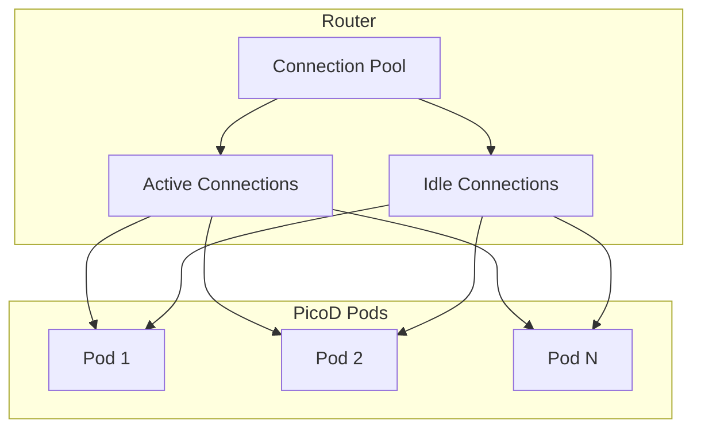
```mermaid
graph TB
    subgraph "Router"
        A[Connection Pool]
        B[Active Connections]
        C[Idle Connections]
    end

    subgraph "PicoD Pods"
        D[Pod 1]
        E[Pod 2]
        F[Pod N]
    end

    A --> B
    A --> C
    B --> D
    B --> E
    B --> F
    C --> D
    C --> E
    C --> F
```

### Caching Strategy

```mermaid
graph TB
    subgraph "Router"
        A[L1: Memory Cache]
        B[L2: Redis Cache]
    end

    subgraph "Storage"
        C[Redis]
        D[Kubernetes API]
    end

    A -->|Miss| B
    B -->|Miss| C
    C -->|Miss| D
    D --> C
    C --> B
    B --> A
```

## Next Steps

- [Security Architecture](security.md): Learn about security design
- [Observability](observability.md): Learn about monitoring and logging
- [API Documentation](/api/overview): Explore the APIs