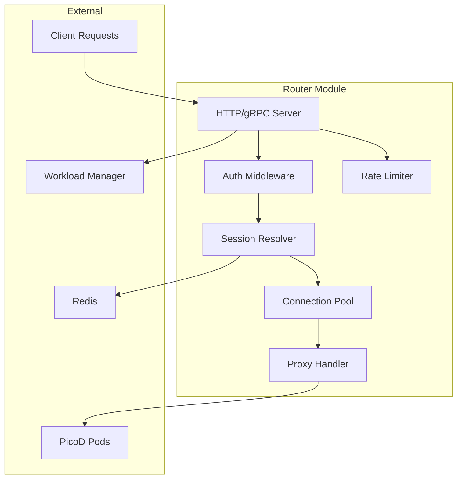
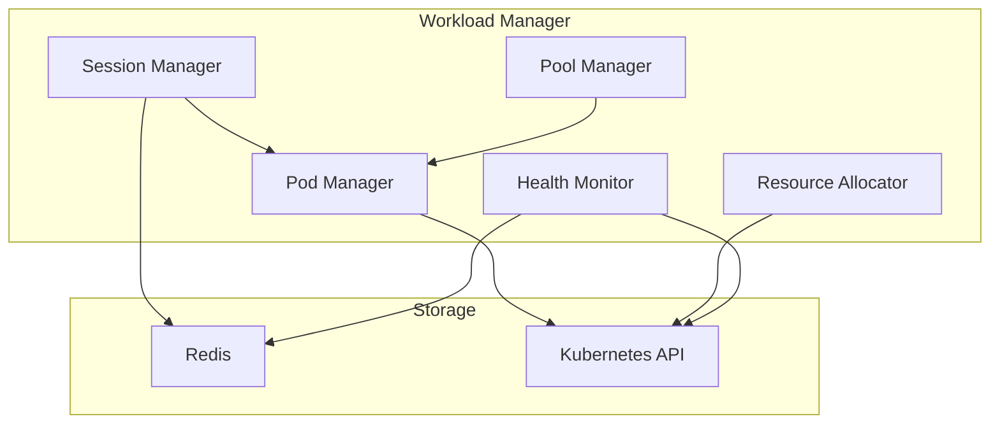
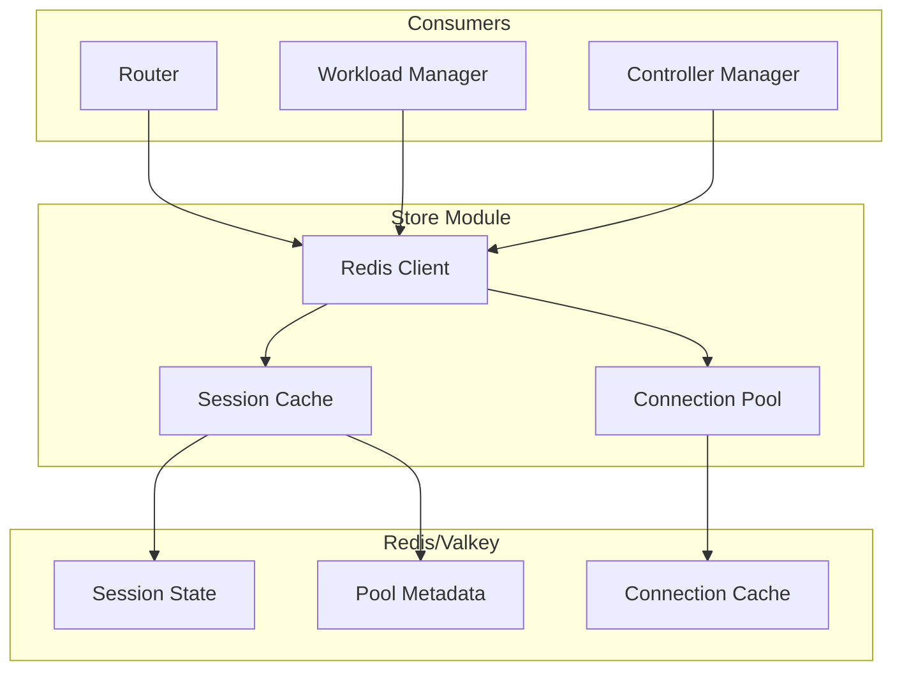
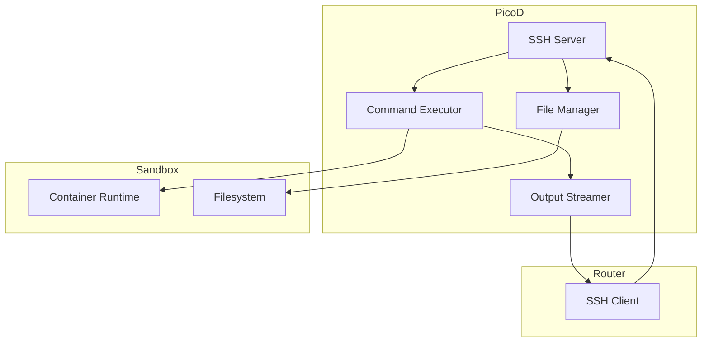
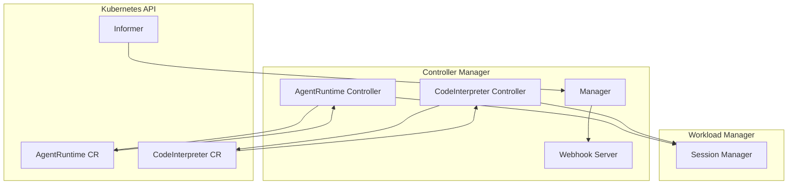
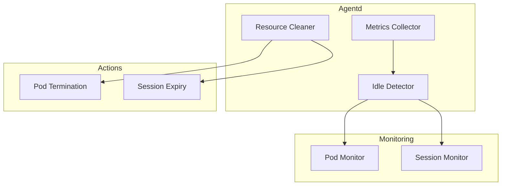
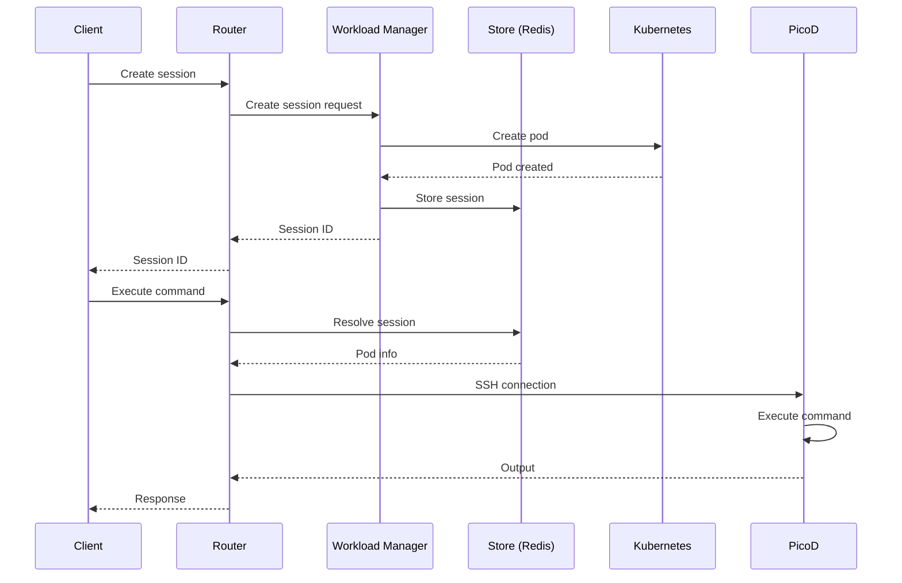

# Component Modules

This document provides detailed technical information about each component module in the AgentCube architecture.

## Router Module

### Overview

The Router is the ingress component that handles all incoming requests from clients. It acts as the gateway to the AgentCube platform, providing authentication, routing, and proxying capabilities.

### Architecture



### Key Components

#### HTTP/gRPC Server

- **Framework**: Uses `grpc-go` and standard HTTP server
- **Ports**: Configurable (default: 8080)
- **Graceful Shutdown**: Handles SIGTERM/SIGINT signals

**Endpoints**:
- `POST /v1/sessions/{namespace}/{kind}/{name}`: Create session
- `GET /v1/sessions/{namespace}/{kind}/{name}/{session-id}`: Get session info
- `DELETE /v1/sessions/{namespace}/{kind}/{name}/{session-id}`: Delete session
- `POST /api/execute`: Execute command (proxy to PicoD)
- `GET /api/files`: List files (proxy to PicoD)
- `POST /api/files`: Upload file (proxy to PicoD)

#### Authentication Middleware

Supports multiple authentication methods:

1. **Bearer Token**: JWT or opaque tokens
2. **Kubernetes TokenReview**: Service account tokens
3. **None**: Disable authentication for trusted environments

```go
type AuthConfig struct {
    Mode          string `json:"mode"` // "token", "k8s", "none"
    JWTSecret     string `json:"jwt_secret,omitempty"`
    TokenReviewURL string `json:"token_review_url,omitempty"`
}

func (a *AuthMiddleware) Authenticate(req *http.Request) error {
    // Implementation
}
```

#### Session Resolver

Maps session IDs to sandbox pods:

```go
type SessionInfo struct {
    SessionID   string `json:"session_id"`
    PodName     string `json:"pod_name"`
    PodIP       string `json:"pod_ip"`
    PodPort     int32  `json:"pod_port"`
    Namespace   string `json:"namespace"`
    CRName      string `json:"cr_name"`
    CRKind      string `json:"cr_kind"`
    CreatedAt   time.Time `json:"created_at"`
    ExpiresAt   time.Time `json:"expires_at"`
}

type SessionResolver struct {
    redisClient *redis.Client
    cache       *lru.Cache
}

func (r *SessionResolver) Resolve(sessionID string) (*SessionInfo, error) {
    // Check cache first
    if info, ok := r.cache.Get(sessionID); ok {
        return info.(*SessionInfo), nil
    }

    // Query Redis
    info, err := r.queryRedis(sessionID)
    if err != nil {
        return nil, err
    }

    // Update cache
    r.cache.Add(sessionID, info)
    return info, nil
}
```

#### Connection Pool

Maintains connections to PicoD pods:

```go
type SSHConnectionPool struct {
    mu    sync.Mutex
    conns map[string]*SSHClient
    ttl   time.Duration
}

func (p *SSHConnectionPool) Get(podIP string, port int32) (*SSHClient, error) {
    p.mu.Lock()
    defer p.mu.Unlock()

    key := fmt.Sprintf("%s:%d", podIP, port)

    if conn, ok := p.conns[key]; ok {
        if time.Since(conn.createdAt) < p.ttl {
            return conn, nil
        }
        conn.Close()
        delete(p.conns, key)
    }

    conn, err := NewSSHClient(podIP, port)
    if err != nil {
        return nil, err
    }

    p.conns[key] = conn
    return conn, nil
}
```

### Session Routing Logic

1. **Session Creation**:
   - Validate request parameters
   - Check authentication
   - Forward to Workload Manager
   - Return session ID to client

2. **Session Resolution**:
   - Extract session ID from header or URL
   - Look up session info in cache/Redis
   - Verify session is not expired
   - Return pod connection details

3. **Request Proxying**:
   - Establish SSH connection to PicoD
   - Forward command execution request
   - Stream output back to client
   - Handle connection errors

### Configuration

```yaml
router:
  replicas: 2
  image:
    repository: agentcube/router
    tag: "v1.0.0"
  service:
    type: ClusterIP
    port: 8080
    targetPort: 8080
  resources:
    requests:
      cpu: "100m"
      memory: "256Mi"
    limits:
      cpu: "500m"
      memory: "512Mi"
  debug: true
  auth:
    mode: "token"
    jwt_secret: "${JWT_SECRET}"
  connection_pool:
    max_connections: 1000
    ttl: "5m"
  timeout:
    connect: "10s"
    read: "120s"
    write: "120s"
```

### Metrics Exposed

- `router_requests_total`: Total requests processed
- `router_request_duration_seconds`: Request latency
- `router_connections_active`: Active connections
- `router_session_cache_hits`: Cache hit rate
- `router_session_resolve_errors`: Resolution errors

---

## Workload Manager Module

### Overview

The Workload Manager is the control plane component responsible for managing the lifecycle of execution sessions. It handles session creation, deletion, warm pool management, and resource allocation.

### Architecture



### Key Components

#### Session Manager

Manages session lifecycle:

```go
type SessionManager struct {
    redisClient *redis.Client
    k8sClient   kubernetes.Interface
    poolManager *PoolManager
}

func (m *SessionManager) CreateSession(req *CreateSessionRequest) (*Session, error) {
    // Validate request
    if err := m.validateRequest(req); err != nil {
        return nil, err
    }

    // Check CR exists
    cr, err := m.getCR(req.Namespace, req.Kind, req.Name)
    if err != nil {
        return nil, err
    }

    // Get pod from pool or create new
    pod, err := m.poolManager.Acquire(req.Namespace, req.Kind, req.Name)
    if err != nil {
        return nil, err
    }

    // Create session
    session := &Session{
        ID:        generateUUID(),
        PodName:   pod.Name,
        PodIP:     pod.Status.PodIP,
        CRName:    req.Name,
        CRKind:    req.Kind,
        Namespace: req.Namespace,
        CreatedAt: time.Now(),
        ExpiresAt: time.Now().Add(time.Duration(req.TTL) * time.Second),
        Metadata:  req.Metadata,
    }

    // Store in Redis
    if err := m.storeSession(session); err != nil {
        m.poolManager.Release(pod.Name)
        return nil, err
    }

    return session, nil
}

func (m *SessionManager) DeleteSession(sessionID string) error {
    // Get session info
    session, err := m.getSession(sessionID)
    if err != nil {
        return err
    }

    // Delete from Redis
    if err := m.deleteSession(sessionID); err != nil {
        return err
    }

    // Return pod to pool
    if err := m.poolManager.Release(session.PodName); err != nil {
        return err
    }

    return nil
}
```

#### Pool Manager

Manages warm pool of pre-initialized pods:

```go
type PoolManager struct {
    k8sClient kubernetes.Interface
    redis     *redis.Client
    pools     map[string]*WarmPool
    mu        sync.RWMutex
}

type WarmPool struct {
    CRKey      string
    Size       int
    Available  []string
    InUse      map[string]bool
    MaxWait    time.Duration
}

func (p *PoolManager) Acquire(namespace, kind, name string) (*v1.Pod, error) {
    crKey := fmt.Sprintf("%s/%s/%s", namespace, kind, name)

    p.mu.RLock()
    pool, ok := p.pools[crKey]
    p.mu.RUnlock()

    if !ok || len(pool.Available) == 0 {
        // Create new pod
        return p.createPod(namespace, kind, name)
    }

    p.mu.Lock()
    defer p.mu.Unlock()

    podName := pool.Available[0]
    pool.Available = pool.Available[1:]
    pool.InUse[podName] = true

    return p.getPod(namespace, podName)
}

func (p *PoolManager) Release(podName string) error {
    p.mu.Lock()
    defer p.mu.Unlock()

    for _, pool := range p.pools {
        if inUse, ok := pool.InUse[podName]; ok && inUse {
            pool.InUse[podName] = false
            pool.Available = append(pool.Available, podName)
            return nil
        }
    }

    return fmt.Errorf("pod not in use: %s", podName)
}

func (p *PoolManager) MaintainPools() {
    ticker := time.NewTicker(30 * time.Second)
    defer ticker.Stop()

    for range ticker.C {
        p.ensurePoolSize()
    }
}
```

#### Pod Manager

Interacts with Kubernetes API:

```go
type PodManager struct {
    k8sClient kubernetes.Interface
}

func (m *PodManager) CreatePod(cr *CodeInterpreter) (*v1.Pod, error) {
    pod := &v1.Pod{
        ObjectMeta: metav1.ObjectMeta{
            Name:      generatePodName(cr.Name),
            Namespace: cr.Namespace,
            Labels: map[string]string{
                "app":             "agentcube-sandbox",
                "cr-name":         cr.Name,
                "cr-kind":         "CodeInterpreter",
                "managed-by":      "agentcube",
            },
        },
        Spec: *cr.Spec.Template.DeepCopy(),
    }

    return m.k8sClient.CoreV1().Pods(cr.Namespace).Create(context.TODO(), pod, metav1.CreateOptions{})
}

func (m *PodManager) DeletePod(namespace, name string) error {
    return m.k8sClient.CoreV1().Pods(namespace).Delete(context.TODO(), name, metav1.DeleteOptions{})
}

func (m *PodManager) GetPod(namespace, name string) (*v1.Pod, error) {
    return m.k8sClient.CoreV1().Pods(namespace).Get(context.TODO(), name, metav1.GetOptions{})
}
```

#### Health Monitor

Monitors pod and session health:

```go
type HealthMonitor struct {
    k8sClient   kubernetes.Interface
    redisClient *redis.Client
}

func (m *HealthMonitor) Start() {
    go m.monitorSessions()
    go m.monitorPods()
}

func (m *HealthMonitor) monitorSessions() {
    ticker := time.NewTicker(1 * time.Minute)
    defer ticker.Stop()

    for range ticker.C {
        m.expireSessions()
    }
}

func (m *HealthMonitor) expireSessions() {
    // Get all sessions
    sessions, err := m.getAllSessions()
    if err != nil {
        return
    }

    now := time.Now()
    for _, session := range sessions {
        if now.After(session.ExpiresAt) {
            m.DeleteSession(session.ID)
        }
    }
}
```

### Configuration

```yaml
workloadmanager:
  replicas: 1
  image:
    repository: agentcube/workloadmanager
    tag: "v1.0.0"
  service:
    type: ClusterIP
    port: 8080
  resources:
    requests:
      cpu: "100m"
      memory: "256Mi"
    limits:
      cpu: "500m"
      memory: "512Mi"
  healthCheck:
    liveness:
      path: /health
      initialDelaySeconds: 10
      periodSeconds: 10
    readiness:
      path: /health
      initialDelaySeconds: 5
      periodSeconds: 5
  session:
    defaultTimeout: "15m"
    maxTimeout: "8h"
    cleanupInterval: "1m"
  pool:
    maintainInterval: "30s"
    maxWaitTime: "5m"
```

### Metrics Exposed

- `workload_sessions_total`: Total sessions created
- `workload_sessions_active`: Active sessions
- `workload_pool_size`: Current warm pool size
- `workload_pool_available`: Available pods in pool
- `workload_pod_create_duration_seconds`: Pod creation time
- `workload_session_expiry_total`: Expired sessions

---

## Store Module

### Overview

The Store module provides session state storage and caching capabilities using Redis/Valkey.

### Architecture



### Data Structures

#### Session State

```go
type Session struct {
    ID        string                 `json:"id" redis:"id"`
    PodName   string                 `json:"pod_name" redis:"pod_name"`
    PodIP     string                 `json:"pod_ip" redis:"pod_ip"`
    PodPort   int32                  `json:"pod_port" redis:"pod_port"`
    CRName    string                 `json:"cr_name" redis:"cr_name"`
    CRKind    string                 `json:"cr_kind" redis:"cr_kind"`
    Namespace string                 `json:"namespace" redis:"namespace"`
    CreatedAt time.Time              `json:"created_at" redis:"created_at"`
    ExpiresAt time.Time              `json:"expires_at" redis:"expires_at"`
    Metadata  map[string]interface{} `json:"metadata" redis:"metadata"`
}
```

#### Pool Metadata

```go
type PoolMetadata struct {
    CRKey     string   `json:"cr_key" redis:"cr_key"`
    Size      int      `json:"size" redis:"size"`
    Available []string `json:"available" redis:"available"`
    InUse     map[string]bool `json:"in_use" redis:"in_use"`
}

type SessionStore struct {
    redisClient *redis.Client
    codec       Codec
}
```

### Operations

```go
func (s *SessionStore) Create(session *Session) error {
    key := fmt.Sprintf("session:%s", session.ID)

    data, err := s.codec.Encode(session)
    if err != nil {
        return err
    }

    ttl := time.Until(session.ExpiresAt)
    if ttl < 0 {
        ttl = time.Minute
    }

    return s.redisClient.Set(context.Background(), key, data, ttl).Err()
}

func (s *SessionStore) Get(sessionID string) (*Session, error) {
    key := fmt.Sprintf("session:%s", sessionID)

    data, err := s.redisClient.Get(context.Background(), key).Bytes()
    if err != nil {
        if err == redis.Nil {
            return nil, ErrSessionNotFound
        }
        return nil, err
    }

    return s.codec.Decode(data)
}

func (s *SessionStore) Delete(sessionID string) error {
    key := fmt.Sprintf("session:%s", sessionID)
    return s.redisClient.Del(context.Background(), key).Err()
}

func (s *SessionStore) List(namespace, kind, name string) ([]*Session, error) {
    pattern := fmt.Sprintf("session:*")

    iter := s.redisClient.Scan(context.Background(), 0, pattern, 0).Iterator()
    var sessions []*Session

    for iter.Next(context.Background()) {
        session, err := s.Get(strings.TrimPrefix(iter.Val(), "session:"))
        if err != nil {
            continue
        }

        if session.Namespace == namespace &&
           session.CRKind == kind &&
           session.CRName == name {
            sessions = append(sessions, session)
        }
    }

    return sessions, iter.Err()
}
```

### Configuration

```yaml
redis:
  addr: "redis-master:6379"
  password: ""
  db: 0
  pool:
    max_idle: 100
    max_active: 1000
    idle_timeout: "5m"
  session:
    ttl: "15m"
    max_ttl: "8h"
```

### Cache Strategies

1. **LRU Cache**: In-memory cache for frequently accessed sessions
2. **TTL-based**: Automatic expiration of session state
3. **Persistent Mode**: Optional RDB/AOF persistence
4. **Pub/Sub**: Event notifications for session changes

---

## PicoD Module

### Overview

PicoD (Pod Interception Daemon) runs inside each sandbox pod and handles command execution, file operations, and SSH connections.

### Architecture



### Key Components

#### SSH Server

```go
type SSHServer struct {
    config *SSHConfig
    auth   AuthHandler
    handler CommandHandler
}

type SSHConfig struct {
    HostKey     string `json:"host_key"`
    Port        int    `json:"port"`
    AuthMode    string `json:"auth_mode"`
    TokenSecret string `json:"token_secret"`
}

func (s *SSHServer) Start() error {
    config := &ssh.ServerConfig{
        PublicKeyCallback: s.auth.PublicKeyCallback,
        PasswordCallback:  s.auth.PasswordCallback,
    }

    privateBytes, err := os.ReadFile(s.config.HostKey)
    if err != nil {
        return err
    }

    private, err := ssh.ParsePrivateKey(privateBytes)
    if err != nil {
        return err
    }

    config.AddHostKey(private)

    listener, err := net.Listen("tcp", fmt.Sprintf(":%d", s.config.Port))
    if err != nil {
        return err
    }

    for {
        conn, err := listener.Accept()
        if err != nil {
            continue
        }

        go s.handleConnection(conn)
    }
}

func (s *SSHServer) handleConnection(conn net.Conn) {
    sshConn, chans, reqs, err := ssh.NewServerConn(conn, s.config)
    if err != nil {
        return
    }

    go ssh.DiscardRequests(reqs)

    for newChannel := range chans {
        if newChannel.ChannelType() != "session" {
            newChannel.Reject(ssh.UnknownChannelType, "unknown channel type")
            continue
        }

        channel, _, err := newChannel.Accept()
        if err != nil {
            continue
        }

        go s.handleSession(channel)
    }
}
```

#### Command Executor

```go
type CommandExecutor struct {
    timeout time.Duration
    env     []string
}

type CommandRequest struct {
    Command []string          `json:"command"`
    Timeout string           `json:"timeout"`
    Env     map[string]string `json:"env"`
}

type CommandResponse struct {
    Stdout   string `json:"stdout"`
    Stderr   string `json:"stderr"`
    ExitCode int    `json:"exit_code"`
    Duration int64  `json:"duration_ms"`
}

func (e *CommandExecutor) Execute(req *CommandRequest) (*CommandResponse, error) {
    ctx, cancel := context.WithTimeout(context.Background(), e.timeout)
    defer cancel()

    cmd := exec.CommandContext(ctx, req.Command[0], req.Command[1:]...)

    for k, v := range req.Env {
        cmd.Env = append(cmd.Env, fmt.Sprintf("%s=%s", k, v))
    }

    stdout, err := cmd.StdoutPipe()
    if err != nil {
        return nil, err
    }

    stderr, err := cmd.StderrPipe()
    if err != nil {
        return nil, err
    }

    start := time.Now()
    if err := cmd.Start(); err != nil {
        return nil, err
    }

    stdoutBuf := new(bytes.Buffer)
    stderrBuf := new(bytes.Buffer)

    io.Copy(stdoutBuf, stdout)
    io.Copy(stderrBuf, stderr)

    err = cmd.Wait()
    duration := time.Since(start).Milliseconds()

    response := &CommandResponse{
        Stdout:   stdoutBuf.String(),
        Stderr:   stderrBuf.String(),
        Duration: duration,
    }

    if err != nil {
        if exitErr, ok := err.(*exec.ExitError); ok {
            response.ExitCode = exitErr.ExitCode()
        } else {
            response.ExitCode = -1
        }
    } else {
        response.ExitCode = 0
    }

    return response, nil
}
```

#### File Manager

```go
type FileManager struct {
    baseDir string
}

type FileOperationRequest struct {
    Operation string `json:"operation"` // upload, download, list, delete
    Path      string `json:"path"`
    Content   string `json:"content,omitempty"` // base64 encoded
}

func (m *FileManager) Upload(path string, content []byte) error {
    fullPath := filepath.Join(m.baseDir, path)

    if err := os.MkdirAll(filepath.Dir(fullPath), 0755); err != nil {
        return err
    }

    return os.WriteFile(fullPath, content, 0644)
}

func (m *FileManager) Download(path string) ([]byte, error) {
    fullPath := filepath.Join(m.baseDir, path)
    return os.ReadFile(fullPath)
}

func (m *FileManager) List(path string) ([]os.FileInfo, error) {
    fullPath := filepath.Join(m.baseDir, path)
    return os.ReadDir(fullPath)
}

func (m *FileManager) Delete(path string) error {
    fullPath := filepath.Join(m.baseDir, path)
    return os.RemoveAll(fullPath)
}
```

### Configuration

PicoD is configured via environment variables:

```yaml
env:
  - name: PICOD_PORT
    value: "2222"
  - name: PICOD_AUTH_MODE
    value: "token"
  - name: PICOD_TOKEN_SECRET
    valueFrom:
      secretKeyRef:
        name: agentcube-secrets
        key: picod-token
  - name: PICOD_TIMEOUT
    value: "120s"
  - name: PICOD_BASE_DIR
    value: "/workspace"
```

### Metrics Exposed

- `picod_commands_total`: Total commands executed
- `picod_command_duration_seconds`: Command execution time
- `picod_ssh_connections_active`: Active SSH connections
- `picod_file_operations_total`: File operation counts
- `picod_errors_total`: Error counts by type

---

## Controller Manager Module

### Overview

The Controller Manager implements Kubernetes controllers for AgentRuntime and CodeInterpreter CRDs, reconciling desired state with actual cluster state.

### Architecture



### Controller Implementation

#### AgentRuntime Controller

```go
type AgentRuntimeReconciler struct {
    client.Client
    Scheme        *runtime.Scheme
    recorder      record.EventRecorder
    wmClient      WorkloadManagerClient
}

func (r *AgentRuntimeReconciler) Reconcile(ctx context.Context, req ctrl.Request) (ctrl.Result, error) {
    log := log.FromContext(ctx)

    var agentRuntime runtimev1alpha1.AgentRuntime
    if err := r.Get(ctx, req.NamespacedName, &agentRuntime); err != nil {
        return ctrl.Result{}, client.IgnoreNotFound(err)
    }

    // Check for deletion
    if !agentRuntime.DeletionTimestamp.IsZero() {
        return r.handleDeletion(ctx, &agentRuntime)
    }

    // Initialize finalizer
    if !controllerutil.ContainsFinalizer(&agentRuntime, agentRuntimeFinalizer) {
        controllerutil.AddFinalizer(&agentRuntime, agentRuntimeFinalizer)
        if err := r.Update(ctx, &agentRuntime); err != nil {
            return ctrl.Result{}, err
        }
    }

    // Reconcile
    status, err := r.reconcileAgentRuntime(ctx, &agentRuntime)
    if err != nil {
        r.recorder.Eventf(&agentRuntime, corev1.EventTypeWarning, "ReconcileFailed", err.Error())
        return ctrl.Result{}, err
    }

    // Update status
    if !reflect.DeepEqual(agentRuntime.Status, status) {
        agentRuntime.Status = status
        if err := r.Status().Update(ctx, &agentRuntime); err != nil {
            return ctrl.Result{}, err
        }
    }

    return ctrl.Result{RequeueAfter: r.getRequeueInterval(&agentRuntime)}, nil
}

func (r *AgentRuntimeReconciler) reconcileAgentRuntime(ctx context.Context, ar *runtimev1alpha1.AgentRuntime) (runtimev1alpha1.AgentRuntimeStatus, error) {
    status := ar.Status.DeepCopy()

    // Update condition
    status.Conditions = r.setCondition(status.Conditions, runtimev1alpha1.AgentRuntimeCondition{
        Type:               runtimev1alpha1.Ready,
        Status:             corev1.ConditionTrue,
        Reason:             "Ready",
        Message:            "AgentRuntime is ready",
        LastTransitionTime: metav1.Now(),
    })

    return *status, nil
}

func (r *AgentRuntimeReconciler) handleDeletion(ctx context.Context, ar *runtimev1alpha1.AgentRuntime) (ctrl.Result, error) {
    log := log.FromContext(ctx)

    if controllerutil.ContainsFinalizer(ar, agentRuntimeFinalizer) {
        // Clean up resources
        if err := r.cleanupAgentRuntime(ctx, ar); err != nil {
            return ctrl.Result{}, err
        }

        // Remove finalizer
        controllerutil.RemoveFinalizer(ar, agentRuntimeFinalizer)
        if err := r.Update(ctx, ar); err != nil {
            return ctrl.Result{}, err
        }
    }

    log.Info("AgentRuntime deleted", "name", ar.Name)
    return ctrl.Result{}, nil
}
```

#### CodeInterpreter Controller

```go
type CodeInterpreterReconciler struct {
    client.Client
    Scheme        *runtime.Scheme
    recorder      record.EventRecorder
    wmClient      WorkloadManagerClient
}

func (r *CodeInterpreterReconciler) Reconcile(ctx context.Context, req ctrl.Request) (ctrl.Result, error) {
    log := log.FromContext(ctx)

    var ci runtimev1alpha1.CodeInterpreter
    if err := r.Get(ctx, req.NamespacedName, &ci); err != nil {
        return ctrl.Result{}, client.IgnoreNotFound(err)
    }

    if !ci.DeletionTimestamp.IsZero() {
        return r.handleDeletion(ctx, &ci)
    }

    if !controllerutil.ContainsFinalizer(&ci, codeInterpreterFinalizer) {
        controllerutil.AddFinalizer(&ci, codeInterpreterFinalizer)
        if err := r.Update(ctx, &ci); err != nil {
            return ctrl.Result{}, err
        }
    }

    status, err := r.reconcileCodeInterpreter(ctx, &ci)
    if err != nil {
        r.recorder.Eventf(&ci, corev1.EventTypeWarning, "ReconcileFailed", err.Error())
        return ctrl.Result{}, err
    }

    if !reflect.DeepEqual(ci.Status, status) {
        ci.Status = status
        if err := r.Status().Update(ctx, &ci); err != nil {
            return ctrl.Result{}, err
        }
    }

    return ctrl.Result{RequeueAfter: r.getRequeueInterval(&ci)}, nil
}

func (r *CodeInterpreterReconciler) reconcileCodeInterpreter(ctx context.Context, ci *runtimev1alpha1.CodeInterpreter) (runtimev1alpha1.CodeInterpreterStatus, error) {
    status := ci.Status.DeepCopy()

    // Get CR template
    template := ci.Spec.Template

    // Check warm pool
    if ci.Spec.WarmPoolSize > 0 {
        if err := r.maintainWarmPool(ctx, ci); err != nil {
            return *status, err
        }
    }

    // Update status
    status.WarmPoolSize = ci.Spec.WarmPoolSize
    status.AvailablePods = r.countAvailablePods(ctx, ci)

    status.Conditions = r.setCondition(status.Conditions, runtimev1alpha1.CodeInterpreterCondition{
        Type:               runtimev1alpha1.Ready,
        Status:             corev1.ConditionTrue,
        Reason:             "Ready",
        Message:            "CodeInterpreter is ready",
        LastTransitionTime: metav1.Now(),
    })

    return *status, nil
}
```

### Webhook Server

```go
type WebhookServer struct {
    server *http.Server
}

func (s *WebhookServer) Start() error {
    mux := http.NewServeMux()
    mux.HandleFunc("/validate-agentruntime", s.validateAgentRuntime)
    mux.HandleFunc("/validate-codeinterpreter", s.validateCodeInterpreter)
    mux.HandleFunc("/mutate-agentruntime", s.mutateAgentRuntime)
    mux.HandleFunc("/mutate-codeinterpreter", s.mutateCodeInterpreter)

    s.server = &http.Server{
        Addr:    ":9443",
        Handler: mux,
    }

    return s.server.ListenAndServeTLS("", "")
}

func (s *WebhookServer) validateAgentRuntime(w http.ResponseWriter, r *http.Request) {
    var ar runtimev1alpha1.AgentRuntime
    if err := json.NewDecoder(r.Body).Decode(&ar); err != nil {
        admissionResponse := admission.ErrorResponse(err)
        admission.WriteResponse(w, admissionResponse)
        return
    }

    // Validation logic
    admissionResponse := admission.Allowed("valid")
    admission.WriteResponse(w, admissionResponse)
}
```

### Configuration

```yaml
controller:
  replicas: 1
  image:
    repository: agentcube/controller
    tag: "v1.0.0"
  resources:
    requests:
      cpu: "100m"
      memory: "128Mi"
    limits:
      cpu: "200m"
      memory: "256Mi"
  metrics:
    bindAddress: ":8080"
  webhook:
    port: 9443
  leaderElection:
    enabled: true
    leaseDuration: "15s"
    renewDeadline: "10s"
    retryPeriod: "2s"
```

### Metrics Exposed

- `controller_reconcile_total`: Reconciliation operations
- `controller_reconcile_duration_seconds`: Reconciliation time
- `controller_webhook_requests_total`: Webhook requests
- `controller_workqueue_depth`: Work queue depth
- `controller_leader_status`: Leader election status

---

## Agentd Module

### Overview

Agentd (Agent Daemon) monitors and manages idle resources, performing cleanup and optimization tasks.

### Architecture



### Key Components

#### Idle Detector

```go
type IdleDetector struct {
    k8sClient   kubernetes.Interface
    redisClient *redis.Client
    thresholds  IdleThresholds
}

type IdleThresholds struct {
    PodIdleTime      time.Duration
    SessionIdleTime  time.Duration
    CheckInterval    time.Duration
}

func (d *IdleDetector) Start() {
    ticker := time.NewTicker(d.thresholds.CheckInterval)
    defer ticker.Stop()

    for range ticker.C {
        d.detectIdlePods()
        d.detectIdleSessions()
    }
}

func (d *IdleDetector) detectIdlePods() {
    pods, err := d.k8sClient.CoreV1().Pods("").List(context.Background(), metav1.ListOptions{
        LabelSelector: "app=agentcube-sandbox",
    })
    if err != nil {
        return
    }

    for _, pod := range pods.Items {
        if d.isPodIdle(&pod) {
            log.Info("Idle pod detected", "pod", pod.Name)
            d.cleanupPod(&pod)
        }
    }
}

func (d *IdleDetector) isPodIdle(pod *v1.Pod) bool {
    // Check last activity timestamp
    lastActivity := getLastActivityTime(pod)
    idleTime := time.Since(lastActivity)

    return idleTime > d.thresholds.PodIdleTime
}
```

#### Resource Cleaner

```go
type ResourceCleaner struct {
    k8sClient kubernetes.Interface
    redis     *redis.Client
}

func (c *ResourceCleaner) cleanupPod(pod *v1.Pod) error {
    // Check if pod is in use
    if c.isPodInUse(pod.Name) {
        return fmt.Errorf("pod is in use: %s", pod.Name)
    }

    // Delete pod
    return c.k8sClient.CoreV1().Pods(pod.Namespace).Delete(context.Background(), pod.Name, metav1.DeleteOptions{})
}

func (c *ResourceCleaner) cleanupSession(sessionID string) error {
    // Delete session from Redis
    key := fmt.Sprintf("session:%s", sessionID)
    return c.redis.Del(context.Background(), key).Err()
}
```

#### Metrics Collector

```go
type MetricsCollector struct {
    registry *prometheus.Registry
}

func (c *MetricsCollector) collect() {
    idlePodsGauge.Set(float64(c.countIdlePods()))
    idleSessionsGauge.Set(float64(c.countIdleSessions()))
    cleanupOperationsTotal.Inc()
}

var (
    idlePodsGauge = prometheus.NewGauge(prometheus.GaugeOpts{
        Name: "agentd_idle_pods",
        Help: "Number of idle pods detected",
    })

    idleSessionsGauge = prometheus.NewGauge(prometheus.GaugeOpts{
        Name: "agentd_idle_sessions",
        Help: "Number of idle sessions detected",
    })

    cleanupOperationsTotal = prometheus.NewCounter(prometheus.CounterOpts{
        Name: "agentd_cleanup_operations_total",
        Help: "Total number of cleanup operations",
    })
)
```

### Configuration

```yaml
agentd:
  replicas: 1
  image:
    repository: agentcube/agentd
    tag: "v1.0.0"
  resources:
    requests:
      cpu: "50m"
      memory: "64Mi"
    limits:
      cpu: "200m"
      memory: "256Mi"
  thresholds:
    podIdleTime: "10m"
    sessionIdleTime: "30m"
    checkInterval: "1m"
```

### Metrics Exposed

- `agentd_idle_pods`: Number of idle pods
- `agentd_idle_sessions`: Number of idle sessions
- `agentd_cleanup_operations_total`: Cleanup operations
- `agentd_cleanup_duration_seconds`: Cleanup time
- `agentd_scrape_duration_seconds`: Scrape time

## Module Communication

### Communication Protocols

1. **HTTP/gRPC**: Router ↔ Workload Manager
2. **Redis**: All components ↔ Store
3. **Kubernetes API**: Workload Manager/Controller ↔ K8s
4. **SSH**: Router ↔ PicoD

### Data Flow



## Next Steps

- [Data Flow](data-flow.md): Understand detailed data flow patterns
- [Security](security.md): Learn about security architecture
- [Observability](observability.md): Learn about monitoring and logging