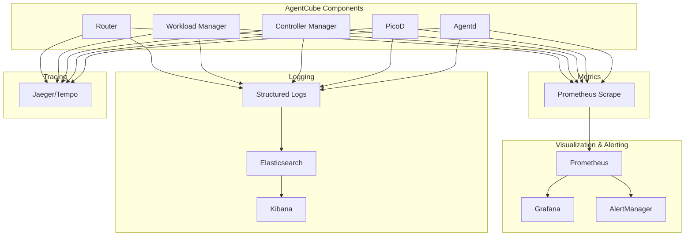
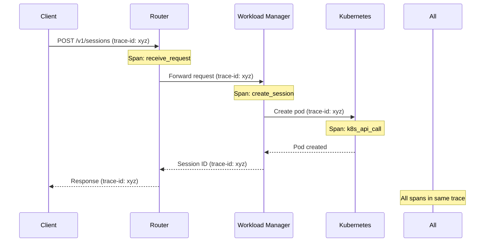
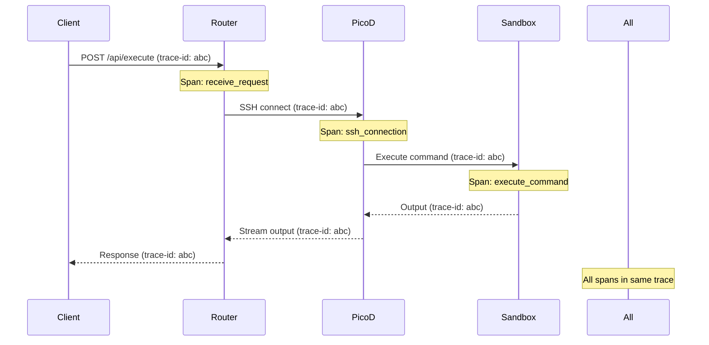

# Observability

This document describes the observability architecture of AgentCube, including monitoring, logging, distributed tracing, and alerting.

## Observability Stack



## Monitoring

### Metrics Collection

AgentCube components expose Prometheus metrics on the `/metrics` endpoint:

**Router Metrics**:
```go
var (
    requestDuration = prometheus.NewHistogramVec(
        prometheus.HistogramOpts{
            Name: "router_request_duration_seconds",
            Help: "Request duration in seconds",
            Buckets: prometheus.DefBuckets,
        },
        []string{"method", "endpoint", "status"},
    )

    activeConnections = prometheus.NewGauge(
        prometheus.GaugeOpts{
            Name: "router_connections_active",
            Help: "Number of active connections",
        },
    )

    sessionCacheHits = prometheus.NewCounter(
        prometheus.CounterOpts{
            Name: "router_session_cache_hits_total",
            Help: "Total session cache hits",
        },
    )
)
```

**Workload Manager Metrics**:
```go
var (
    sessionsCreated = prometheus.NewCounter(
        prometheus.CounterOpts{
            Name: "workload_sessions_created_total",
            Help: "Total sessions created",
        },
    )

    activeSessions = prometheus.NewGaugeVec(
        prometheus.GaugeOpts{
            Name: "workload_sessions_active",
            Help: "Number of active sessions",
        },
        []string{"namespace", "kind", "name"},
    )

    poolSize = prometheus.NewGaugeVec(
        prometheus.GaugeOpts{
            Name: "workload_pool_size",
            Help: "Current warm pool size",
        },
        []string{"namespace", "kind", "name"},
    )
)
```

### Key Performance Indicators (KPIs)

#### Throughput Metrics

| Metric | Description | Target |
|--------|-------------|--------|
| `router_requests_total` | Total requests processed | Increase over time |
| `workload_sessions_created_total` | Sessions created per second | >10/s |
| `workload_session_duration_seconds` | Session duration | Varies by workload |

#### Latency Metrics

| Metric | Description | Target |
|--------|-------------|--------|
| `router_request_duration_seconds` | Request latency | P95 < 1s |
| `workload_pod_create_duration_seconds` | Pod creation time | P95 < 30s |
| `picod_command_duration_seconds` | Command execution time | P95 < 30s |

#### Error Metrics

| Metric | Description | Target |
|--------|-------------|--------|
| `router_request_errors_total` | Request errors | <1% |
| `workload_session_creation_failures_total` | Session creation failures | <0.1% |
| `picod_command_failures_total` | Command failures | <5% |

#### Resource Metrics

| Metric | Description | Target |
|--------|-------------|--------|
| `workload_pods_active` | Active pods | Within quota |
| `workload_memory_usage_bytes` | Memory usage | <80% limit |
| `workload_cpu_usage_percent` | CPU usage | <80% limit |

### Prometheus Configuration

```yaml
apiVersion: v1
kind: ConfigMap
metadata:
  name: prometheus-config
data:
  prometheus.yml: |
    global:
      scrape_interval: 15s
      evaluation_interval: 15s

    scrape_configs:
    - job_name: 'agentcube-router'
      kubernetes_sd_configs:
      - role: pod
      relabel_configs:
      - source_labels: [__meta_kubernetes_pod_label_app]
        regex: agentcube-router
        action: keep

    - job_name: 'agentcube-workload-manager'
      kubernetes_sd_configs:
      - role: pod
      relabel_configs:
      - source_labels: [__meta_kubernetes_pod_label_app]
        regex: workloadmanager
        action: keep

    - job_name: 'agentcube-controller'
      kubernetes_sd_configs:
      - role: pod
      relabel_configs:
      - source_labels: [__meta_kubernetes_pod_label_app]
        regex: controller-manager
        action: keep

    - job_name: 'agentcube-agentd'
      kubernetes_sd_configs:
      - role: pod
      relabel_configs:
      - source_labels: [__meta_kubernetes_pod_label_app]
        regex: agentd
        action: keep
```

### Grafana Dashboards

#### Overview Dashboard

```json
{
  "dashboard": {
    "title": "AgentCube Overview",
    "panels": [
      {
        "title": "Request Rate",
        "targets": [
          {
            "expr": "rate(router_requests_total[5m])",
            "legendFormat": "{{method}} {{endpoint}}"
          }
        ]
      },
      {
        "title": "Active Sessions",
        "targets": [
          {
            "expr": "sum(workload_sessions_active)",
            "legendFormat": "Active Sessions"
          }
        ]
      },
      {
        "title": "Request Latency (P95)",
        "targets": [
          {
            "expr": "histogram_quantile(0.95, rate(router_request_duration_seconds_bucket[5m]))",
            "legendFormat": "P95 Latency"
          }
        ]
      },
      {
        "title": "Error Rate",
        "targets": [
          {
            "expr": "rate(router_request_errors_total[5m]) / rate(router_requests_total[5m]) * 100",
            "legendFormat": "Error Rate %"
          }
        ]
      }
    ]
  }
}
```

#### Session Dashboard

```json
{
  "dashboard": {
    "title": "Session Management",
    "panels": [
      {
        "title": "Sessions Created Rate",
        "targets": [
          {
            "expr": "rate(workload_sessions_created_total[5m])",
            "legendFormat": "Sessions/s"
          }
        ]
      },
      {
        "title": "Sessions by Namespace",
        "targets": [
          {
            "expr": "sum(workload_sessions_active) by (namespace)",
            "legendFormat": "{{namespace}}"
          }
        ]
      },
      {
        "title": "Warm Pool Utilization",
        "targets": [
          {
            "expr": "sum(workload_pool_size) by (namespace, name)",
            "legendFormat": "{{namespace}}/{{name}}"
          }
        ]
      }
    ]
  }
}
```

## Logging

### Log Format

Structured JSON logging with correlation IDs:

```go
type LogEntry struct {
    Timestamp   time.Time              `json:"timestamp"`
    Level       string                 `json:"level"`
    Message     string                 `json:"message"`
    Component   string                 `json:"component"`
    RequestID   string                 `json:"request_id,omitempty"`
    SessionID   string                 `json:"session_id,omitempty"`
    UserID      string                 `json:"user_id,omitempty"`
    Method      string                 `json:"method,omitempty"`
    Path        string                 `json:"path,omitempty"`
    Status      int                    `json:"status,omitempty"`
    Duration    int64                  `json:"duration_ms,omitempty"`
    Error       string                 `json:"error,omitempty"`
    Stack       string                 `json:"stack,omitempty"`
    Fields      map[string]interface{} `json:"fields,omitempty"`
}

func LogInfo(ctx context.Context, component, message string, fields ...zap.Field) {
    entry := &LogEntry{
        Timestamp: time.Now(),
        Level:     "info",
        Component: component,
        Message:   message,
    }

    if requestID := GetRequestID(ctx); requestID != "" {
        entry.RequestID = requestID
    }

    if sessionID := GetSessionID(ctx); sessionID != "" {
        entry.SessionID = sessionID
    }

    data, _ := json.Marshal(entry)
    fmt.Println(string(data))
}
```

### Log Levels

| Level | Usage | Examples |
|-------|-------|----------|
| DEBUG | Detailed troubleshooting | Connection details, internal state |
| INFO | Normal operations | Session creation, request completion |
| WARN | Warning conditions | Slow requests, resource pressure |
| ERROR | Errors requiring attention | Failed requests, pod failures |
| FATAL | Critical errors | Service unavailable |

### Log Collection

**Fluentd Configuration**:
```yaml
apiVersion: v1
kind: ConfigMap
metadata:
  name: fluentd-config
data:
  fluent.conf: |
    <source>
      @type tail
      @id agentcube_logs
      path /var/log/containers/agentcube*.log
      pos_file /var/log/fluentd-agentcube-containers.log.pos
      tag kubernetes.*
      read_from_head true
      <parse>
        @type json
        time_format %Y-%m-%dT%H:%M:%S.%NZ
      </parse>
    </source>

    <filter kubernetes.**>
      @type kubernetes_metadata
    </filter>

    <match **>
      @type elasticsearch
      host elasticsearch.logging.svc.cluster.local
      port 9200
      index_name agentcube-logs
      type_name _doc
      logstash_format true
      logstash_prefix agentcube
      <buffer>
        @type file
        path /var/log/fluentd-buffers/kubernetes.system.buffer
        flush_mode interval
        flush_interval 5s
      </buffer>
    </match>
```

### Log Analysis

**Common Queries**:

1. **Error rate by component**:
```json
{
  "query": {
    "bool": {
      "must": [
        {"match": {"level": "error"}},
        {"range": {"timestamp": {"gte": "now-1h"}}}
      ]
    }
  },
  "aggs": {
    "by_component": {
      "terms": {"field": "component.keyword"}
    }
  }
}
```

2. **Slow requests**:
```json
{
  "query": {
    "bool": {
      "must": [
        {"range": {"duration_ms": {"gte": 5000}}},
        {"range": {"timestamp": {"gte": "now-1h"}}}
      ]
    }
  },
  "sort": [
    {"duration_ms": {"order": "desc"}}
  ]
}
```

3. **Session creation failures**:
```json
{
  "query": {
    "bool": {
      "must": [
        {"match_phrase": {"message": "session creation failed"}},
        {"range": {"timestamp": {"gte": "now-1h"}}}
      ]
    }
  }
}
```

## Distributed Tracing

### Trace Context Propagation

```go
func StartSpan(ctx context.Context, name string, opts ...trace.SpanStartOption) (context.Context, trace.Span) {
    tracer := otel.Tracer("agentcube")

    return tracer.Start(ctx, name, opts...)
}

func GetTraceID(ctx context.Context) string {
    span := trace.SpanFromContext(ctx)
    if span == nil {
        return ""
    }

    spanContext := span.SpanContext()
    return spanContext.TraceID().String()
}
```

### Trace Scenarios

#### Session Creation Trace



#### Command Execution Trace



### Jaeger Configuration

```yaml
apiVersion: v1
kind: ConfigMap
metadata:
  name: jaeger-config
data:
  jaeger.yml: |
    sampled: true
    reporter:
      logSpans: true
      localAgentHostPort: "jaeger-agent:6831"
    sampler:
      type: const
      param: 1
    headers:
      jaegerDebugHeader: "jaeger-debug-id"
      jaegerBaggageHeader: "jaeger-baggage"
      TraceContextHeaderName: "uber-trace-id"
```

## Alerting

### Alert Rules

**Critical Alerts**:
```yaml
apiVersion: monitoring.coreos.com/v1
kind: PrometheusRule
metadata:
  name: agentcube-critical
spec:
  groups:
  - name: critical
    rules:
    - alert: HighErrorRate
      expr: rate(router_request_errors_total[5m]) / rate(router_requests_total[5m]) > 0.05
      for: 5m
      labels:
        severity: critical
      annotations:
        summary: "High error rate detected"
        description: "Error rate is {{ $value | humanizePercentage }} for 5 minutes"

    - alert: SessionCreationFailure
      expr: rate(workload_session_creation_failures_total[5m]) > 0.1
      for: 5m
      labels:
        severity: critical
      annotations:
        summary: "Session creation failing"
        description: "{{ $value }} session creation failures per second"

    - alert: PodNotReady
      expr: kube_pod_status_ready{condition="true"} == 0
      for: 5m
      labels:
        severity: critical
      annotations:
        summary: "Pod not ready"
        description: "Pod {{ $labels.pod }} in namespace {{ $labels.namespace }} is not ready"
```

**Warning Alerts**:
```yaml
apiVersion: monitoring.coreos.com/v1
kind: PrometheusRule
metadata:
  name: agentcube-warning
spec:
  groups:
  - name: warning
    rules:
    - alert: HighLatency
      expr: histogram_quantile(0.95, rate(router_request_duration_seconds_bucket[5m])) > 2
      for: 5m
      labels:
        severity: warning
      annotations:
        summary: "High request latency"
        description: "P95 latency is {{ $value }}s"

    - alert: LowPoolAvailability
      expr: sum(workload_pool_size) by (namespace, name) / sum(workload_pool_desired_size) by (namespace, name) < 0.2
      for: 5m
      labels:
        severity: warning
      annotations:
        summary: "Low pool availability"
        description: "Pool availability for {{ $labels.namespace }}/{{ $labels.name }} is {{ $value | humanizePercentage }}"

    - alert: HighMemoryUsage
      expr: container_memory_usage_bytes / container_spec_memory_limit_bytes > 0.9
      for: 5m
      labels:
        severity: warning
      annotations:
        summary: "High memory usage"
        description: "Container {{ $labels.container }} is using {{ $value | humanizePercentage }} of memory limit"
```

### AlertManager Configuration

```yaml
apiVersion: v1
kind: ConfigMap
metadata:
  name: alertmanager-config
data:
  alertmanager.yml: |
    global:
      resolve_timeout: 5m

    route:
      receiver: 'default-receiver'
      group_wait: 30s
      group_interval: 5m
      repeat_interval: 12h
      group_by: ['alertname', 'severity']

      routes:
      - match:
          severity: critical
        receiver: 'pagerduty'
      - match:
          severity: warning
        receiver: 'slack'

    receivers:
    - name: 'default-receiver'

    - name: 'pagerduty'
      pagerduty_configs:
      - service_key: '<PAGERDUTY_SERVICE_KEY>'

    - name: 'slack'
      slack_configs:
      - api_url: '<SLACK_WEBHOOK_URL>'
        channel: '#agentcube-alerts'
        title: '{{ .GroupLabels.alertname }}'
        text: '{{ range .Alerts }}{{ .Annotations.description }}{{ end }}'
```

## Performance Monitoring

### Query Performance

```go
type QueryMonitor struct {
    registry *prometheus.Registry
}

func (m *QueryMonitor) RecordQuery(query string, duration time.Duration, err error) {
    labels := prometheus.Labels{
        "query": query,
        "error": fmt.Sprintf("%v", err),
    }

    queryDuration.With(labels).Observe(duration.Seconds())
    queryTotal.With(labels).Inc()
}
```

### Database Performance

```go
var (
    dbQueryDuration = prometheus.NewHistogramVec(
        prometheus.HistogramOpts{
            Name: "db_query_duration_seconds",
            Help: "Database query duration",
        },
        []string{"operation", "table"},
    )

    dbConnectionPool = prometheus.NewGaugeVec(
        prometheus.GaugeOpts{
            Name: "db_connection_pool_size",
            Help: "Database connection pool size",
        },
        []string{"state"}, // idle, in_use
    )
)
```

### Cache Performance

```go
var (
    cacheHitRate = prometheus.NewGaugeVec(
        prometheus.GaugeOpts{
            Name: "cache_hit_rate",
            Help: "Cache hit rate",
        },
        []string{"cache"},
    )

    cacheEvictions = prometheus.NewCounterVec(
        prometheus.CounterOpts{
            Name: "cache_evictions_total",
            Help: "Total cache evictions",
        },
        []string{"cache"},
    )
)
```

## Health Checks

### Component Health

```go
type HealthChecker struct {
    checks map[string]HealthCheck
}

type HealthCheck struct {
    Name     string
    Check    func() error
    Timeout  time.Duration
}

func (h *HealthChecker) Check() map[string]string {
    results := make(map[string]string)

    for name, check := range h.checks {
        ctx, cancel := context.WithTimeout(context.Background(), check.Timeout)
        defer cancel()

        err := check.Check()
        if err != nil {
            results[name] = fmt.Sprintf("unhealthy: %v", err)
        } else {
            results[name] = "healthy"
        }
    }

    return results
}
```

### Health Endpoint

```yaml
# /health endpoint response
{
  "status": "healthy",
  "checks": {
    "router": "healthy",
    "workload_manager": "healthy",
    "redis": "healthy",
    "kubernetes": "healthy"
  },
  "timestamp": "2024-01-01T00:00:00Z"
}
```

## Observability Best Practices

### 1. Structured Logging

- Use structured JSON logs
- Include correlation IDs
- Add relevant context
- Log at appropriate levels

### 2. Metric Naming

- Use consistent naming conventions
- Include units in metric names
- Use labels for dimensions
- Document metric semantics

### 3. Trace Context

- Propagate trace context across services
- Add meaningful span names
- Include relevant attributes
- Sample appropriately

### 4. Alert Thresholds

- Set realistic thresholds
- Avoid alert fatigue
- Use severity levels
- Document alert actions

## Next Steps

- [API Documentation](/api/overview): Explore the APIs
- [Deployment Guide](/deployment/overview): Deploy with monitoring
- [Troubleshooting](/operations/troubleshooting): Debug issues