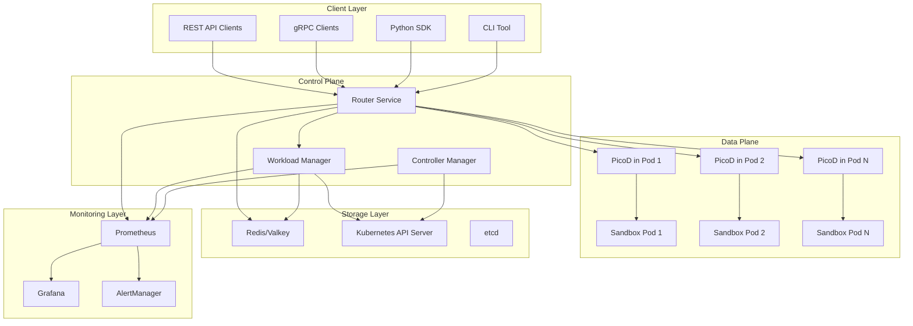
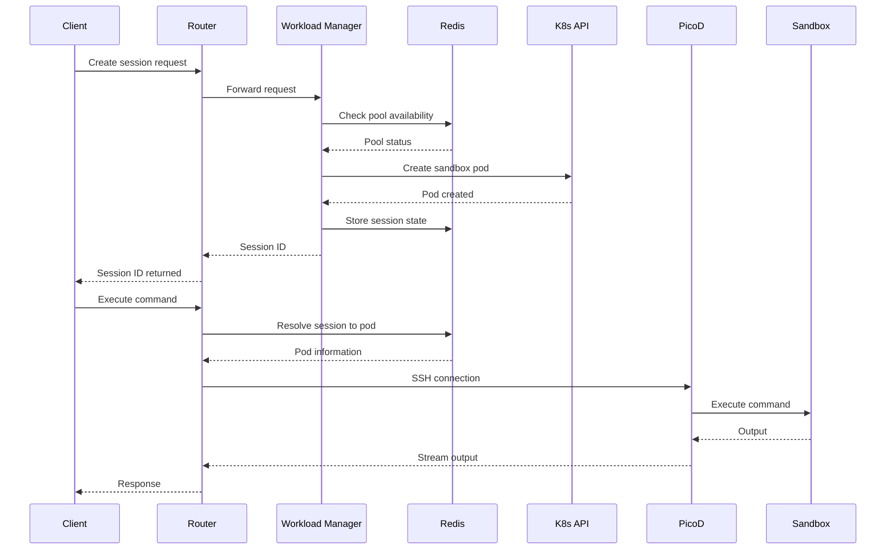
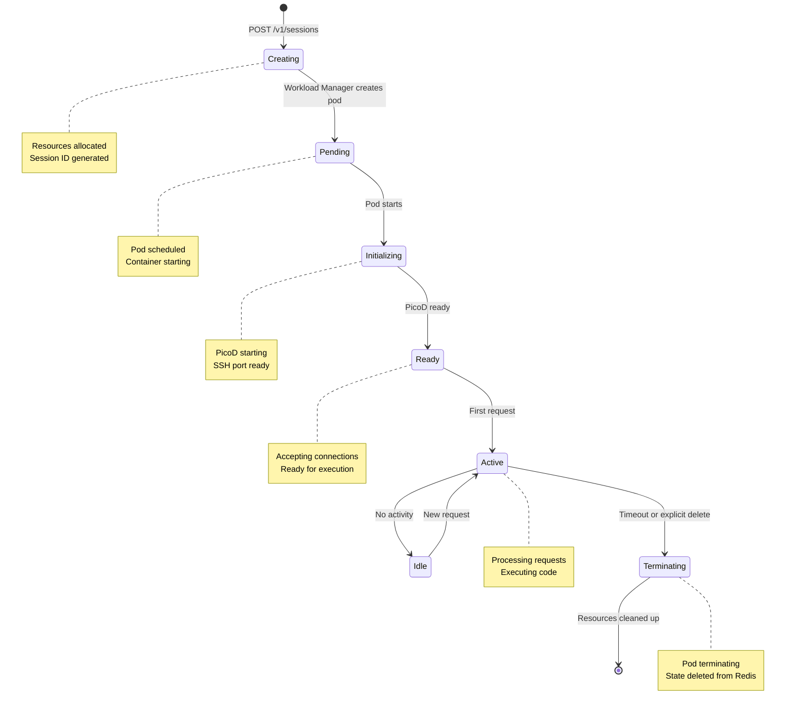

# Architecture Overview

This document provides a high-level overview of the AgentCube system architecture, including core components, technology stack, and design principles.

## System Architecture

AgentCube follows a cloud-native, microservices architecture designed for scalability, reliability, and security. The system is built on Kubernetes and consists of several interconnected components.

## Core Components

### Router

**Purpose**: The entry point for all client requests

**Responsibilities**:
- HTTP/gRPC request handling
- Authentication and authorization
- Session routing and resolution
- Connection proxying to data plane
- Load balancing across instances
- Health checks and circuit breaking

**Implementation**:
- Written in Go
- Exposes REST and gRPC APIs
- Uses connection pooling for efficiency
- Implements graceful shutdown

**Key Features**:
- Session ID resolution to sandbox pods
- WebSocket support for streaming
- Request timeout handling
- Rate limiting support

### Workload Manager

**Purpose**: Manages the lifecycle of execution sessions

**Responsibilities**:
- Session creation and deletion
- Sandbox pod lifecycle management
- Warm pool management
- Resource allocation and scheduling
- Session state management
- Health monitoring of sessions

**Implementation**:
- Written in Go
- Implements Kubernetes controller pattern
- Uses Redis for session state
- Integrates with Kubernetes scheduler

**Key Features**:
- Automatic session expiration
- Warm pool pre-warming
- Resource quota enforcement
- Session metrics collection

### Controller Manager

**Purpose**: Reconciles Custom Resources (CRs) with cluster state

**Responsibilities**:
- CRD reconciliation (AgentRuntime, CodeInterpreter)
- Status updates and event emission
- Admission webhooks for validation
- Finalizer management for cleanup

**Implementation**:
- Written in Go
- Uses Kubernetes controller-runtime
- Implements reconcile loop pattern
- Supports webhook validation

**Key Features**:
- Event-driven reconciliation
- Status condition tracking
- Validation and mutation webhooks
- Deletion finalizers

### PicoD (Pod Interception Daemon)

**Purpose**: Runs inside sandbox pods to handle execution

**Responsibilities**:
- SSH connection handling
- Command execution
- File operations (upload/download/list)
- Permission enforcement
- Output streaming

**Implementation**:
- Written in Go
- Runs as sidecar in sandbox pods
- Listens on SSH port (2222)
- Uses paramiko for SSH

**Key Features**:
- Secure SSH authentication
- Real-time output streaming
- Resource usage reporting
- Graceful shutdown

### Agentd (Agent Daemon)

**Purpose**: Monitors and manages idle resources

**Responsibilities**:
- Idle session detection
- Resource cleanup
- Metrics collection
- Threshold enforcement

**Implementation**:
- Written in Go
- Runs as daemonset
- Monitors pod activity
- Reports to Prometheus

**Key Features**:
- Configurable idle thresholds
- Automatic cleanup
- Metrics for monitoring
- Event-driven operation

## Technology Stack

### Go (Golang)

**Usage**: Control plane components (Router, Workload Manager, Controller Manager, PicoD, Agentd)

**Benefits**:
- High performance and low latency
- Strong concurrency support
- Excellent Kubernetes ecosystem
- Static typing and safety
- Fast compilation

**Key Libraries**:
- `controller-runtime`: Kubernetes controller framework
- `paramiko`: SSH library for PicoD
- `grpc-go`: gRPC support
- `prometheus/client_golang`: Metrics export

### Python

**Usage**: SDK, examples, and some tooling

**Benefits**:
- Extensive libraries for data science and AI
- Easy to learn and use
- Great for scripting and automation
- Rich ecosystem

**Key Libraries**:
- `requests`: HTTP client
- `paramiko`: SSH client
- `kubernetes`: Kubernetes Python client
- `pydantic`: Data validation

### Kubernetes

**Usage**: Container orchestration and resource management

**Benefits**:
- Declarative configuration
- Self-healing capabilities
- Horizontal scaling
- Service discovery
- Extensibility through CRDs

**Key Features Used**:
- Custom Resource Definitions (CRDs)
- Controllers and operators
- Services and networking
- Resource quotas and limits
- RBAC and security

### Redis/Valkey

**Usage**: Session state storage and caching

**Benefits**:
- Fast in-memory operations
- Persistence options
- Pub/Sub for events
- Cluster support
- Rich data structures

**Usage Patterns**:
- Session state storage
- Connection pooling
- Cache for frequent lookups
- Event notification

## Design Principles

### 1. Cloud Native

AgentCube is built from the ground up for cloud environments:

- **Declarative Configuration**: Use CRDs to define desired state
- **Self-Healing**: Automatic recovery from failures
- **Horizontal Scaling**: Scale components independently
- **Observability**: Built-in metrics and logging

### 2. Security First

Security is a core design consideration:

- **Defense in Depth**: Multiple layers of isolation
- **Least Privilege**: Minimal permissions for each component
- **Secure by Default**: Authentication and authorization enabled
- **Audit Logging**: Comprehensive audit trails

### 3. Extensibility

The system is designed to be extended:

- **Pluggable Architectures**: Support for custom runtimes
- **Flexible Configuration**: Environment-based configuration
- **Custom Resources**: Define custom execution environments
- **Event-Driven**: React to system events

### 4. Operator Pattern

Follows Kubernetes best practices:

- **Declarative API**: Define desired state
- **Controller Pattern**: Reconcile actual to desired state
- **Status Conditions**: Report current status
- **Event Emission**: Notify of important events

### 5. Separation of Concerns

Clear boundaries between components:

- **Control Plane**: Management and orchestration
- **Data Plane**: Execution and isolation
- **Storage Layer**: State persistence
- **Monitoring Layer**: Observability

## Component Interaction

### Request Processing Flow

### Session Lifecycle

## Scalability Considerations

### Horizontal Scaling

All control plane components can be horizontally scaled:

- **Router**: Stateless, scale behind load balancer
- **Workload Manager**: Leader election, scale for throughput
- **Controller Manager**: Leader election, scale for reconciliation
- **PicoD**: One per sandbox pod, auto-scaled

### Vertical Scaling

Resource allocation per component:

- **Router**: CPU and memory for request handling
- **Workload Manager**: Depends on session creation rate
- **Controller Manager**: Typically low resource usage
- **PicoD**: Allocated per session

### Auto-Scaling

Supports various auto-scaling strategies:

- **Horizontal Pod Autoscaler (HPA)**: Scale based on CPU/memory
- **Cluster Autoscaler**: Scale cluster based on pod scheduling
- **Volcano Scheduler**: Batch workload scheduling
- **Custom Metrics**: Scale based on business metrics

## Reliability

### High Availability

- **Redundant Components**: Run multiple replicas
- **Leader Election**: Single leader for stateful operations
- **Graceful Shutdown**: Handle pod termination gracefully
- **Health Checks**: Probe-based health monitoring

### Failure Recovery

- **Self-Healing**: Kubernetes recreates failed pods
- **Retry Logic**: Transient failures are retried
- **Circuit Breakers**: Prevent cascading failures
- **Timeout Handling**: Appropriate timeouts for all operations

### Data Persistence

- **Redis**: Session state with optional persistence
- **etcd**: Kubernetes cluster state
- **Database**: Optional persistent storage for analytics

## Performance

### Optimization Strategies

- **Connection Pooling**: Reuse connections for efficiency
- **Warm Pools**: Pre-warm pods for fast startup
- **Caching**: Cache frequently accessed data
- **Asynchronous Processing**: Non-blocking operations

### Benchmarks

Typical performance characteristics:

- **Session Creation**: 2-5 seconds (with warm pool: <100ms)
- **Command Execution**: Depends on command complexity
- **File Upload**: Limited by network bandwidth
- **Memory Usage**: ~50-100MB per component (excluding sandboxes)

## Security Architecture

See [Security Architecture](security.md) for detailed security design.

## Next Steps

- [Component Details](modules.md): Learn about each component in detail
- [Data Flow](data-flow.md): Understand data flow patterns
- [Security](security.md): Learn about security architecture
- [Observability](observability.md): Learn about monitoring and logging