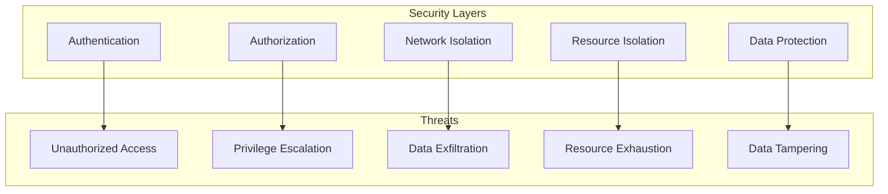
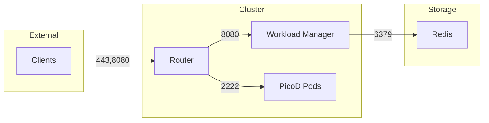
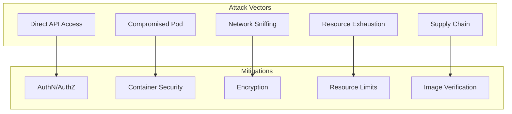

# Security Architecture

This document describes the security architecture of AgentCube, including authentication, authorization, isolation mechanisms, and data protection.

## Security Overview

AgentCube implements defense-in-depth security with multiple layers of protection:

- **Authentication**: Verify identity of users and services
- **Authorization**: Control access to resources and operations
- **Network Isolation**: Separate network traffic between components
- **Resource Isolation**: Limit resource usage and prevent resource exhaustion
- **Data Protection**: Encrypt data at rest and in transit



## Authentication

### Authentication Methods

AgentCube supports multiple authentication mechanisms:

#### 1. JWT Token Authentication

**Configuration**:
```yaml
router:
  auth:
    mode: "token"
    jwt_secret: "${JWT_SECRET}"
    jwt_issuer: "agentcube"
    jwt_expiry: "24h"
```

**Flow**:
1. Client obtains JWT token from identity provider
2. Client includes token in `Authorization: Bearer <token>` header
3. Router validates token signature and expiration
4. Extracts user claims for authorization

**Token Validation**:
```go
func (a *JWTAuthenticator) Validate(tokenString string) (*Claims, error) {
    token, err := jwt.ParseWithClaims(tokenString, &Claims{}, func(token *jwt.Token) (interface{}, error) {
        if _, ok := token.Method.(*jwt.SigningMethodHMAC); !ok {
            return nil, fmt.Errorf("unexpected signing method: %v", token.Header["alg"])
        }
        return []byte(a.secret), nil
    })

    if err != nil {
        return nil, err
    }

    if claims, ok := token.Claims.(*Claims); ok && token.Valid {
        return claims, nil
    }

    return nil, fmt.Errorf("invalid token")
}
```

#### 2. Kubernetes TokenReview

**Configuration**:
```yaml
router:
  auth:
    mode: "k8s"
    token_review_url: "https://kubernetes.default.svc"
    api_server_ca: "/var/run/secrets/kubernetes.io/serviceaccount/ca.crt"
```

**Flow**:
1. Client provides Kubernetes service account token
2. Router uses TokenReview API to validate token
3. Kubernetes API verifies token and returns user info
4. Router uses user info for authorization

**Token Review**:
```go
func (a *K8sAuthenticator) Validate(token string) (*UserInfo, error) {
    review := &authenticationv1.TokenReview{
        Spec: authenticationv1.TokenReviewSpec{
            Token: token,
        },
    }

    result, err := a.client.AuthenticationV1().TokenReviews().Create(context.TODO(), review, metav1.CreateOptions{})
    if err != nil {
        return nil, err
    }

    if !result.Status.Authenticated {
        return nil, fmt.Errorf("token not authenticated")
    }

    return &UserInfo{
        Username: result.Status.User.Username,
        UID:      result.Status.User.UID,
        Groups:   result.Status.User.Groups,
    }, nil
}
```

#### 3. No Authentication

**Configuration**:
```yaml
router:
  auth:
    mode: "none"
```

**Use Case**: Trusted environments where authentication is handled by external systems

### Session Authentication

Sessions require additional authentication beyond the initial request:

```go
type SessionAuth struct {
    sessionID string
    token     string
}

func (s *SessionAuth) Validate() error {
    // Verify session exists
    session, err := store.Get(s.sessionID)
    if err != nil {
        return ErrSessionNotFound
    }

    // Verify session not expired
    if time.Now().After(session.ExpiresAt) {
        return ErrSessionExpired
    }

    // Optional: Verify session token
    if s.token != session.Token {
        return ErrInvalidToken
    }

    return nil
}
```

## Authorization

### RBAC Model

AgentCube uses Kubernetes RBAC for authorization:

```yaml
apiVersion: rbac.authorization.k8s.io/v1
kind: ClusterRole
metadata:
  name: agentcube-user
rules:
- apiGroups: ["runtime.agentcube.volcano.sh"]
  resources: ["agentruntimes", "codeinterpreters"]
  verbs: ["get", "list", "watch"]
- apiGroups: ["runtime.agentcube.volcano.sh"]
  resources: ["agentruntimes/sessions", "codeinterpreters/sessions"]
  verbs: ["create", "get", "delete"]
```

### Permission Matrix

| Operation | Read | Create | Update | Delete |
|-----------|------|--------|--------|--------|
| View CRs | ✓ | ✗ | ✗ | ✗ |
| Create Sessions | ✗ | ✓ | ✗ | ✗ |
| Execute Commands | ✗ | ✗ | ✓ | ✗ |
| Delete Sessions | ✗ | ✗ | ✗ | ✓ |

### Namespace Isolation

Resources are scoped to namespaces:

```go
func (a *Authorizer) CanAccess(user, namespace, resource, operation string) bool {
    // Check namespace access
    if !a.canAccessNamespace(user, namespace) {
        return false
    }

    // Check resource access
    if !a.canAccessResource(user, namespace, resource, operation) {
        return false
    }

    return true
}
```

### Webhook Authorization

Custom admission webhooks for fine-grained authorization:

```go
func (w *AuthorizationWebhook) Authorize(ar *admissionv1.AdmissionReview) *admissionv1.AdmissionResponse {
    req := ar.Request

    // Get user info
    userInfo := req.UserInfo

    // Check authorization
    allowed := w.checkAuthorization(userInfo, req)

    if allowed {
        return &admissionv1.AdmissionResponse{
            Allowed: true,
        }
    }

    return &admissionv1.AdmissionResponse{
        Allowed: false,
        Result: &metav1.Status{
            Message: "Access denied",
        },
    }
}
```

## Network Isolation

### Network Policies

Restrict pod-to-pod communication:

```yaml
apiVersion: networking.k8s.io/v1
kind: NetworkPolicy
metadata:
  name: agentcube-network-policy
spec:
  podSelector:
    matchLabels:
      app: agentcube-sandbox
  policyTypes:
  - Ingress
  - Egress
  ingress:
  - from:
    - podSelector:
        matchLabels:
          app: agentcube-router
    ports:
    - protocol: TCP
      port: 2222
  egress:
  - to:
    - podSelector: {}
    ports:
    - protocol: TCP
      port: 53
    - protocol: UDP
      port: 53
```

### Service Mesh Integration

Support for Istio, Linkerd, or other service meshes:

```yaml
apiVersion: networking.istio.io/v1beta1
kind: DestinationRule
metadata:
  name: agentcube-destination
spec:
  host: agentcube-router
  trafficPolicy:
    tls:
      mode: ISTIO_MUTUAL
```

### Firewall Rules

Control traffic between components:



## Resource Isolation

### Resource Limits

Enforce resource quotas:

```yaml
apiVersion: v1
kind: ResourceQuota
metadata:
  name: agentcube-quota
spec:
  hard:
    requests.cpu: "4"
    requests.memory: 8Gi
    limits.cpu: "8"
    limits.memory: 16Gi
    pods: "100"
    agentruntimes.runtime.agentcube.volcano.sh: "10"
    codeinterpreters.runtime.agentcube.volcano.sh: "10"
```

### Pod Resource Limits

Configure per-pod limits:

```yaml
apiVersion: runtime.agentcube.volcano.sh/v1alpha1
kind: CodeInterpreter
metadata:
  name: python-interpreter
spec:
  template:
    spec:
      containers:
        - name: sandbox
          image: agentcube/python-sandbox:latest
          resources:
            requests:
              cpu: "100m"
              memory: "128Mi"
            limits:
              cpu: "500m"
              memory: "512Mi"
```

### Limit Ranges

Prevent resource exhaustion:

```yaml
apiVersion: v1
kind: LimitRange
metadata:
  name: agentcube-limits
spec:
  limits:
  - default:
      cpu: "500m"
      memory: "512Mi"
    defaultRequest:
      cpu: "100m"
      memory: "128Mi"
    type: Container
```

### CPU Throttling

Prevent CPU hogging:

```go
type CPUThrottler struct {
    quotas map[string]float64
}

func (t *CPUThrottler) Throttle(podName string, cpuPercent float64) {
    quota, ok := t.quotas[podName]
    if !ok {
        return
    }

    if cpuPercent > quota {
        // Throttle CPU usage
        t.applyCFSQuota(podName, quota)
    }
}
```

## Container Security

### Seccomp Profiles

Restrict system calls:

```yaml
apiVersion: v1
kind: Pod
metadata:
  name: secure-pod
spec:
  containers:
  - name: sandbox
    image: agentcube/python-sandbox:latest
    securityContext:
      seccompProfile:
        type: RuntimeDefault
```

### Capabilities

Limit Linux capabilities:

```yaml
apiVersion: v1
kind: Pod
metadata:
  name: secure-pod
spec:
  containers:
  - name: sandbox
    image: agentcube/python-sandbox:latest
    securityContext:
      capabilities:
        drop:
        - ALL
        add:
        - CHOWN
        - SETGID
        - SETUID
```

### Read-Only Root Filesystem

Prevent modifications to root filesystem:

```yaml
apiVersion: v1
kind: Pod
metadata:
  name: secure-pod
spec:
  containers:
  - name: sandbox
    image: agentcube/python-sandbox:latest
    securityContext:
      readOnlyRootFilesystem: true
    volumeMounts:
    - name: tmp
      mountPath: /tmp
  volumes:
  - name: tmp
    emptyDir: {}
```

### Non-Root User

Run as non-root user:

```yaml
apiVersion: v1
kind: Pod
metadata:
  name: secure-pod
spec:
  containers:
  - name: sandbox
    image: agentcube/python-sandbox:latest
    securityContext:
      runAsNonRoot: true
      runAsUser: 1000
```

## Data Protection

### Encryption at Rest

Encrypt sensitive data in Redis:

```yaml
redis:
  encryption:
    enabled: true
    key: "${ENCRYPTION_KEY}"
    algorithm: "AES-256-GCM"
```

**Implementation**:
```go
type Encryptor struct {
    key       []byte
    algorithm string
}

func (e *Encryptor) Encrypt(plaintext []byte) ([]byte, error) {
    block, err := aes.NewCipher(e.key)
    if err != nil {
        return nil, err
    }

    gcm, err := cipher.NewGCM(block)
    if err != nil {
        return nil, err
    }

    nonce := make([]byte, gcm.NonceSize())
    if _, err := io.ReadFull(rand.Reader, nonce); err != nil {
        return nil, err
    }

    return gcm.Seal(nonce, nonce, plaintext, nil), nil
}
```

### Encryption in Transit

Enable TLS for all communication:

```yaml
router:
  tls:
    enabled: true
    cert_file: "/etc/tls/cert.pem"
    key_file: "/etc/tls/key.pem"
    ca_file: "/etc/tls/ca.pem"
```

**TLS Configuration**:
```go
func NewTLSServer(certFile, keyFile, caFile string) (*http.Server, error) {
    cert, err := tls.LoadX509KeyPair(certFile, keyFile)
    if err != nil {
        return nil, err
    }

    caCert, err := os.ReadFile(caFile)
    if err != nil {
        return nil, err
    }

    caCertPool := x509.NewCertPool()
    caCertPool.AppendCertsFromPEM(caCert)

    tlsConfig := &tls.Config{
        Certificates: []tls.Certificate{cert},
        ClientCAs:    caCertPool,
        ClientAuth:   tls.RequireAndVerifyClientCert,
        MinVersion:   tls.VersionTLS12,
        CipherSuites: []uint16{
            tls.TLS_ECDHE_RSA_WITH_AES_128_GCM_SHA256,
            tls.TLS_ECDHE_RSA_WITH_AES_256_GCM_SHA384,
        },
    }

    server := &http.Server{
        Addr:      ":8080",
        TLSConfig: tlsConfig,
    }

    return server, nil
}
```

### SSH Security

Secure SSH connections:

```yaml
picod:
  ssh:
    host_key_type: "rsa"
    host_key_bits: 4096
    key_exchange: "curve25519-sha256"
    ciphers:
      - "chacha20-poly1305@openssh.com"
      - "aes256-gcm@openssh.com"
    macs:
      - "hmac-sha2-256-etm@openssh.com"
      - "hmac-sha2-512-etm@openssh.com"
```

### Secret Management

Store secrets securely:

```yaml
apiVersion: v1
kind: Secret
metadata:
  name: agentcube-secrets
type: Opaque
stringData:
  jwt_secret: "${JWT_SECRET}"
  redis_password: "${REDIS_PASSWORD}"
  encryption_key: "${ENCRYPTION_KEY}"
```

## Auditing

### Audit Logging

Record all security-relevant events:

```go
type AuditLogger struct {
    writer io.Writer
}

type AuditEvent struct {
    Timestamp   time.Time `json:"timestamp"`
    User        string    `json:"user"`
    Action      string    `json:"action"`
    Resource    string    `json:"resource"`
    Result      string    `json:"result"`
    SourceIP    string    `json:"source_ip"`
    SessionID   string    `json:"session_id,omitempty"`
}

func (l *AuditLogger) Log(event *AuditEvent) error {
    data, err := json.Marshal(event)
    if err != nil {
        return err
    }

    _, err = l.writer.Write(data)
    return err
}
```

### Event Types

| Event Type | Description |
|------------|-------------|
| AUTHN_SUCCESS | Successful authentication |
| AUTHN_FAILURE | Failed authentication |
| AUTHZ_SUCCESS | Successful authorization |
| AUTHZ_FAILURE | Failed authorization |
| SESSION_CREATE | Session created |
| SESSION_DELETE | Session deleted |
| COMMAND_EXECUTE | Command executed |
| FILE_UPLOAD | File uploaded |
| FILE_DOWNLOAD | File downloaded |

## Compliance

### CIS Benchmarks

AgentCube follows CIS Kubernetes benchmarks:

- Control Plane Components: Restricted access
- Worker Nodes: Secure configuration
- Network: Segregated network policies
- Secrets: Encrypted at rest
- Audit: Comprehensive logging

### Security Headers

HTTP security headers:

```go
func (h *SecurityHeaders) AddHeaders(w http.ResponseWriter) {
    w.Header().Set("X-Content-Type-Options", "nosniff")
    w.Header().Set("X-Frame-Options", "DENY")
    w.Header().Set("X-XSS-Protection", "1; mode=block")
    w.Header().Set("Strict-Transport-Security", "max-age=31536000; includeSubDomains")
    w.Header().Set("Content-Security-Policy", "default-src 'self'")
}
```

## Security Best Practices

### 1. Principle of Least Privilege

- Grant minimum required permissions
- Use service accounts with limited scope
- Regularly audit permissions

### 2. Defense in Depth

- Multiple layers of security
- Redundant protection mechanisms
- Fail-safe defaults

### 3. Secure by Default

- Enable authentication and authorization
- Use encrypted communication
- Restrict network access

### 4. Regular Updates

- Keep dependencies up-to-date
- Patch security vulnerabilities
- Review security advisories

### 5. Monitoring and Alerting

- Monitor security events
- Alert on suspicious activity
- Regular security audits

## Threat Model

### Common Threats

| Threat | Mitigation |
|--------|------------|
| Unauthorized Access | Strong authentication, RBAC |
| Privilege Escalation | Least privilege, container security |
| Data Exfiltration | Network isolation, encryption |
| Resource Exhaustion | Resource limits, quotas |
| Supply Chain Attacks | Image signing, vulnerability scanning |

### Attack Vectors



## Security Checklist

### Deployment Security

- [ ] Enable TLS for all communication
- [ ] Configure strong authentication
- [ ] Implement RBAC with least privilege
- [ ] Apply network policies
- [ ] Set resource limits and quotas
- [ ] Use non-root containers
- [ ] Enable seccomp profiles
- [ ] Configure security contexts

### Operational Security

- [ ] Rotate secrets regularly
- [ ] Monitor security events
- [ ] Conduct regular security audits
- [ ] Review access logs
- [ ] Update dependencies
- [ ] Scan container images
- [ ] Test security controls
- [ ] Document security procedures

## Next Steps

- [Observability](observability.md): Learn about monitoring and logging
- [Deployment Guide](/deployment/overview): Deploy securely
- [Best Practices](/tutorials/best-practices): Security best practices