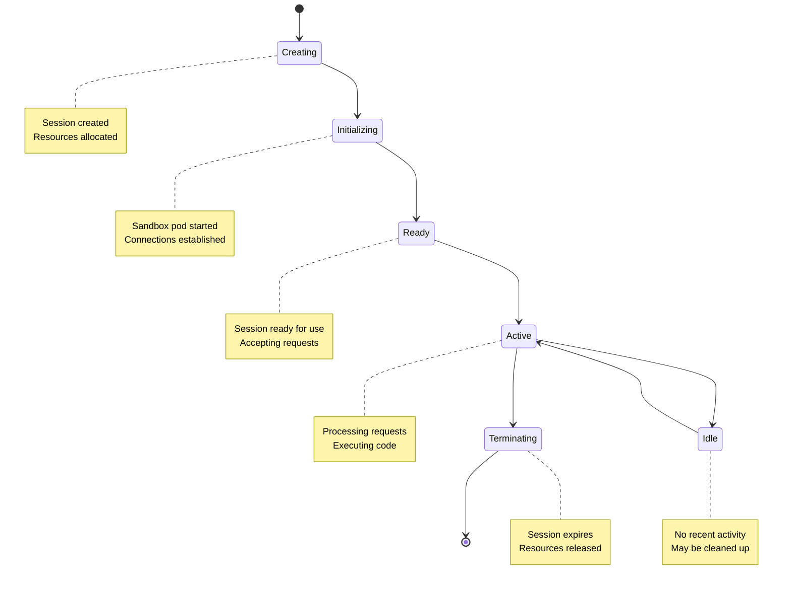
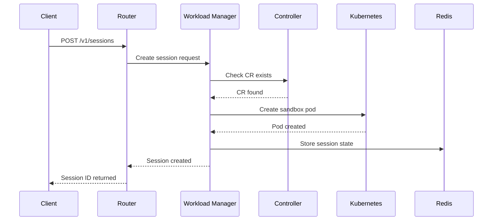

# Core Concepts and Terminology

This document explains the key concepts and terminology used throughout AgentCube. Understanding these concepts will help you make the most of the platform.

## Core Components

### Router

The **Router** is the ingress component that handles all incoming requests from clients. It provides:

- **Session Routing**: Routes requests to the appropriate session
- **Load Balancing**: Distributes traffic across multiple instances
- **Connection Management**: Manages persistent connections
- **Proxying**: Proxies requests to the Workload Manager or data plane

Key responsibilities:
- Authenticate and authorize incoming requests
- Resolve session IDs to sandbox pods
- Proxy WebSocket connections
- Handle graceful shutdown

### Workload Manager

The **Workload Manager** is the control plane component responsible for:

- **Session Lifecycle**: Creating, managing, and deleting sessions
- **Resource Allocation**: Allocating sandboxes based on resource requirements
- **Kubernetes Integration**: Interacts with Kubernetes API to manage resources
- **State Management**: Maintains session state in Redis

Key responsibilities:
- Create sandbox pods on demand
- Manage warm pools for quick session start
- Monitor session health and expiration
- Clean up expired sessions

### PicoD

**PicoD** (Pod Interception Daemon) runs in each sandbox pod and provides:

- **SSH Proxy**: Handles SSH connections to the sandbox
- **Command Execution**: Executes commands within the sandbox
- **File Operations**: Manages file uploads, downloads, and listings
- **Permission Control**: Enforces access permissions

Key responsibilities:
- Listen on SSH port (default: 2222)
- Authenticate incoming SSH connections
- Execute commands within the container
- Stream stdout/stderr to clients

### Controller Manager

The **Controller Manager** implements the Kubernetes controller pattern for:

- **CRD Reconciliation**: Watches and reconciles AgentRuntime and CodeInterpreter CRs
- **Status Updates**: Maintains status information for CRs
- **Event Handling**: Emits Kubernetes events for state changes
- **Webhooks**: Validates and mutates CRs

Key responsibilities:
- Reconcile AgentRuntime CRs
- Reconcile CodeInterpreter CRs
- Update CR status based on actual state
- Handle deletion finalizers

### Agentd

**Agentd** (Agent Daemon) monitors and manages idle resources:

- **Idle Detection**: Identifies idle sessions and pods
- **Resource Cleanup**: Terminates unused resources
- **Metrics Collection**: Collects usage metrics
- **Threshold Enforcement**: Enforces resource limits

Key responsibilities:
- Monitor session activity
- Identify idle warm pool pods
- Terminate idle resources
- Report metrics to Prometheus

## Custom Resources

### AgentRuntime

An **AgentRuntime** defines a custom runtime for executing agent workflows.

```yaml
apiVersion: runtime.agentcube.volcano.sh/v1alpha1
kind: AgentRuntime
metadata:
  name: my-agent
spec:
  ports:
    - name: http
      containerPort: 8080
  template:
    spec:
      containers:
        - name: agent
          image: my-agent:latest
  sessionTimeout: "15m"
  maxSessionDuration: "8h"
```

Key fields:
- **ports**: Container ports to expose
- **template**: Pod template specification
- **sessionTimeout**: Default session timeout
- **maxSessionDuration**: Maximum session duration

### CodeInterpreter

A **CodeInterpreter** defines a runtime for code execution.

```yaml
apiVersion: runtime.agentcube.volcano.sh/v1alpha1
kind: CodeInterpreter
metadata:
  name: python-interpreter
spec:
  ports:
    - name: ssh
      containerPort: 2222
  template:
    spec:
      containers:
        - name: sandbox
          image: agentcube/python-sandbox:latest
  sessionTimeout: "15m"
  maxSessionDuration: "8h"
  warmPoolSize: 2
  authMode: token
```

Key fields:
- **ports**: SSH port configuration
- **template**: Pod template specification
- **sessionTimeout**: Default session timeout
- **maxSessionDuration**: Maximum session duration
- **warmPoolSize**: Number of pre-warmed pods
- **authMode**: Authentication mode (none, token)

## Session Management

### Session Lifecycle

A session goes through the following states:



### Session States

1. **Creating**: Session is being created and resources are being allocated
2. **Initializing**: Sandbox pod is starting up
3. **Ready**: Session is ready to accept requests
4. **Active**: Session is actively processing requests
5. **Idle**: Session has no recent activity
6. **Terminating**: Session is being cleaned up

### Session Timeout

Sessions have configurable timeouts:

- **Session Timeout**: Default time before a session expires (e.g., 15m)
- **Max Session Duration**: Maximum time a session can exist (e.g., 8h)
- **Idle Timeout**: Time before an idle session is cleaned up

## Resource Management

### Warm Pool

A **warm pool** maintains pre-initialized sandbox pods for faster session start:

```yaml
spec:
  warmPoolSize: 2
```

Benefits:
- Faster session creation (no pod startup time)
- Reduced latency for first request
- Better performance for burst traffic

Trade-offs:
- Higher resource usage (pods always running)
- Additional memory and CPU consumption

### Resource Limits

Configure resources in the pod template:

```yaml
template:
  spec:
    containers:
      - name: sandbox
        image: agentcube/python-sandbox:latest
        resources:
          requests:
            cpu: "100m"
            memory: "128Mi"
          limits:
            cpu: "500m"
            memory: "512Mi"
```

Best practices:
- Set appropriate requests and limits
- Monitor resource usage
- Adjust based on actual workload
- Consider autoscaling for high loads

## Security Concepts

### Authentication

AgentCube supports multiple authentication methods:

1. **Token-based**: Using JWT or bearer tokens
2. **Kubernetes TokenReview**: Using K8s service account tokens
3. **None**: No authentication (for trusted environments)

### Authorization

Authorization is enforced via:

- **RBAC**: Kubernetes Role-Based Access Control
- **Namespace Isolation**: Resources scoped to namespaces
- **Permission Controls**: Fine-grained permissions for operations

### Isolation

Multiple layers of isolation:

1. **Namespace Isolation**: Kubernetes namespaces separate tenants
2. **Pod Isolation**: Each session runs in a separate pod
3. **Network Isolation**: Network policies restrict pod communication
4. **Resource Isolation**: CPU and memory limits prevent resource exhaustion

## Data Flow

### Request Flow

1. **Client Request**: Client sends request to Router
2. **Authentication**: Router authenticates the request
3. **Session Resolution**: Router resolves session ID to sandbox pod
4. **Proxying**: Router proxies request to PicoD in the sandbox
5. **Execution**: PicoD executes the command in the container
6. **Response**: Result is streamed back to the client

### Session Creation Flow



## Observability

### Metrics

AgentCube exposes Prometheus metrics for:

- **Router**: Request latency, error rates, active sessions
- **Workload Manager**: Session creation time, pool utilization
- **PicoD**: Command execution time, resource usage
- **Controller**: Reconciliation metrics, CR status

### Logging

Structured logs with correlation IDs:

- Request-level logging
- Session lifecycle events
- Error and warning logs
- Audit trails

### Tracing

Distributed tracing support:

- Request tracing across components
- Session lifecycle tracing
- Operation latency tracking

## Common Patterns

### Session Reuse

Reuse sessions for multiple operations:

```python
with CodeInterpreterClient(...) as client:
    # First operation
    client.run_code("x = 10")
    # Second operation (reuses same session)
    client.run_code("print(x * 2)")
```

### Error Handling

Handle errors gracefully:

```python
from agentcube.exceptions import CommandExecutionError

try:
    client.execute_command(["python3", "invalid.py"])
except CommandExecutionError as e:
    print(f"Command failed: {e.stderr}")
    print(f"Exit code: {e.exit_code}")
```

### Resource Monitoring

Monitor resource usage:

```python
import time

with CodeInterpreterClient(...) as client:
    client.run_code("""
import psutil
import json
print(json.dumps({
    'cpu_percent': psutil.cpu_percent(),
    'memory_percent': psutil.virtual_memory().percent
}))
    """)
```

## Glossary

| Term | Definition |
|------|------------|
| **AgentRuntime** | Custom resource defining agent execution environment |
| **CodeInterpreter** | Custom resource defining code execution environment |
| **CRD** | Custom Resource Definition, Kubernetes API extension |
| **PicoD** | Pod Interception Daemon, runs in sandbox pods |
| **Router** | Ingress component handling all client requests |
| **Session** | Isolated execution context with its own lifecycle |
| **Warm Pool** | Pre-initialized pods for faster session creation |
| **Workload Manager** | Control plane component managing sessions |
| **Namespace** | Kubernetes scope for resource isolation |
| **RBAC** | Role-Based Access Control for authorization |