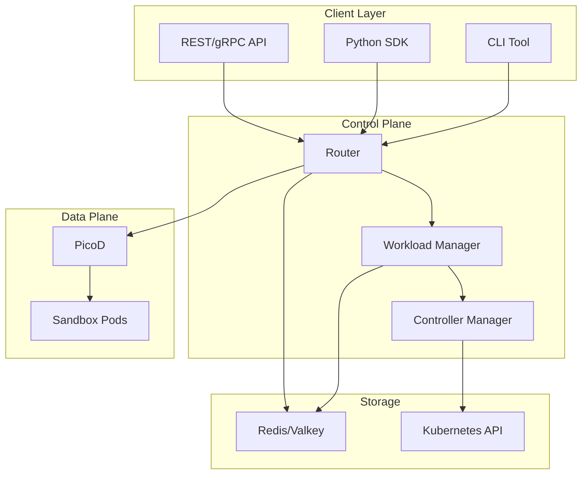

import useBaseUrl from '@docusaurus/useBaseUrl';

# Welcome to AgentCube

AgentCube is a secure and scalable platform for executing code in isolated sandboxes. It provides a comprehensive solution for managing code execution sessions, resource allocation, and multi-tenant isolation on Kubernetes.

## What is AgentCube?

AgentCube is designed to solve the challenges of running untrusted code in a controlled environment. It provides:

- **Secure Sandboxes**: Isolated execution environments with configurable resource limits
- **Session Management**: Robust lifecycle management for code execution sessions
- **Multi-Tenancy**: Support for multiple users and namespaces with proper isolation
- **Resource Control**: Fine-grained control over CPU, memory, and other resources
- **Scalability**: Built on Kubernetes for horizontal scaling
- **Extensibility**: Support for custom resource templates and execution environments

## Key Features

### Secure Execution
AgentCube ensures code execution in fully isolated environments with:
- Network isolation between sandboxes
- Resource limits (CPU, memory, storage)
- Permission controls and RBAC
- Optional authentication and authorization

### Session Lifecycle
Complete session management including:
- Session creation and initialization
- Session reuse and persistence
- Automatic cleanup and resource reclamation
- Session monitoring and observability

### Multiple Execution Modes
Support for various execution scenarios:
- Code execution with multiple language support
- Shell command execution
- File operations (upload, download, list, delete)
- Custom agent runtime for complex workflows

### Cloud Native
Built from the ground up for Kubernetes:
- Custom Resource Definitions (CRDs) for AgentRuntime and CodeInterpreter
- Horizontal Pod Autoscaler integration
- Volcano scheduler support for batch workloads
- Service mesh compatibility

## Architecture Overview

## Use Cases

### AI/ML Applications
- Execute user-provided code in AI applications
- Run Python notebooks and data analysis scripts
- Perform model inference and training in isolated environments

### Code Interpreter Services
- Educational platforms for teaching programming
- Code interview platforms
- Code testing and evaluation services

### Workflow Automation
- Run custom scripts as part of CI/CD pipelines
- Execute user-defined transformations
- Process data in isolated environments

### Data Analysis
- Perform data cleaning and transformation
- Run statistical analysis and modeling
- Execute ETL (Extract, Transform, Load) operations

## Getting Started

Ready to get started? Check out our [Quick Start Guide](quickstart.md) to deploy AgentCube and run your first code execution session.

## Learn More

- **[Architecture](/architecture/overview)**: Learn about the system architecture and components
- **[API Reference](/api/overview)**: Explore the REST, gRPC, and CRD APIs
- **[Deployment Guide](/deployment/overview)**: Deploy AgentCube on Kubernetes
- **[Tutorials](/tutorials/basic-usage)**: Hands-on tutorials and examples

## Community

- **GitHub**: [volcano-sh/agentcube](https://github.com/volcano-sh/agentcube)
- **Discord**: Join our community for support and discussions
- **Contributing**: We welcome contributions! See [Contributing Guide](/CONTRIBUTING.md)

## License

AgentCube is licensed under the Apache 2.0 License.