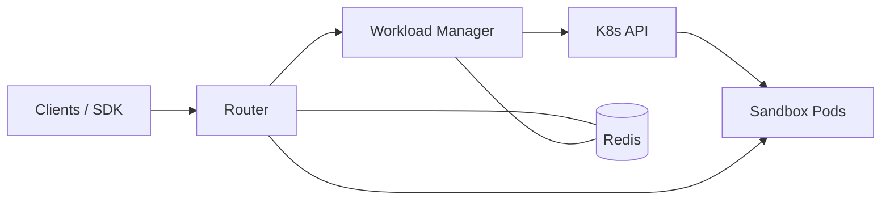

# Architecture overview

AgentCube splits responsibilities into a **control plane** (cluster services, CRDs, coordination) and a **data plane** (sandbox Pods, PicoD, agent HTTP servers).

## Control plane

| Piece | Responsibility |
|-------|------------------|
| **Workload Manager** | Watches `AgentRuntime`, `CodeInterpreter`, and related sandbox CRs; builds Pod/Service objects; writes session metadata to Redis; exposes admin and health APIs. |
| **Router** | Edge HTTP server for `/v1/namespaces/.../agent-runtimes|code-interpreters/.../invocations/*`; resolves sessions; reverse-proxies to backends; enforces global concurrency limits; manages RSA keys for PicoD JWTs. |
| **Redis / Valkey** | Shared store for sessions, caches, and coordination between Router and Workload Manager. |

The Workload Manager is the primary writer of Kubernetes objects; the Router is the primary entrypoint for **client and SDK** traffic bound for sandboxes.

## Data plane

| Piece | Responsibility |
|-------|------------------|
| **Sandbox Pods** | Isolated execution environments defined by `SandboxTemplate` or `CodeInterpreterSandboxTemplate`. |
| **PicoD** | Sidecar or primary container API for command execution and workspace files when `authMode: picod` is enabled. |
| **Agent HTTP servers** | User-defined processes listening on ports declared in `targetPorts` / `ports`. |

Traffic flows **client → Router → (Service/Pod IP) → PicoD or agent process**. The Router may attach a **Bearer JWT** so PicoD can cryptographically verify the caller.

## Interaction sketch

## Related material

- [Components](./components.md) — deeper dive per binary
- [Security](./security.md) — JWT, TokenReview, and hardening
- Repository design doc: `docs/design/agentcube-proposal.md`
